---
---

# Deep Learning on QingCloud AppCenter 用户指南


## 深度学习简介

2016 年 AlphaGo 战胜李世石，预示我们进入了 AI 时代。深度学习是 AI 的核心技术，在图像分类，自然语言处理，无人驾驶等众多领域显示出了强大的能力，各大巨头纷纷投入巨资研发。语音助手，人脸识别，外文翻译等等，AI 已融入到了我们生活的方方面面，极大了促进了社会的发展。其中 Caffe，TensorFlow，Keras，PyTorch 是主流的深度学习框架，拥有强大的社区支持，是实践深度学习不可或缺的工具。

### Caffe

Caffe 是一个被广泛使用的深度学习框架，由 BVLC 开发。Caffe 容易上手，训练速度快，组件模块化，并拥有大量训练好的经典模型。Caffe 在 GPU 上训练的性能很好，但只能支持单机多 GPU 的训练，不支持分布式多机训练。

### TensorFlow

TensorFlow 由 Google 大脑主导开发，是一个分布式系统上的大规模深度学习框架。移植性好，可以运行在移动设备上，并支持分布式多机多卡训练，支持多种深度学习模型。TensorFlow 还有功能强大的可视化组件 TensorBoard，能可视化网络结构和训练过程，对于观察复杂的网络结构和监控长时间、大规模的训练很有帮助。

### PyTorch

PyTorch 从 Torch 发展而来，并经过了大量改进，由 FaceBook AI 团队主导开发。不同于 TensorFlow，PyTorch 采用动态计算图的方式，并提供良好的 Python 接口，代码简单灵活，使用起来非常方便。内存分配也经过了优化，能支持分布式多机训练。

### Keras

Keras 是一个高层神经网络 API，由 Python 编写，通过调用其他深度学习框架来进行计算，如 TensorFlow、Theano 以及 CNTK。Keras 高度模块化，能快速搭建神经网络，并且非常容易上手。

## 青云深度学习平台

基于青云提供的 NVIDIA Tesla P100 GPU，青云深度学习平台提供了 CUDA9.1+cuDNN7.1.3 ， CUDA8.0+cuDNN7.1.3 和 CPU 等3套配置，并安装了流行的深度学习框架，如 TensorFlow(1.6.0/1.7.0)，Caffe(BVLC)，PyTorch(0.3.1)，Keras(2.1.5)，省去了用户搭建环境的麻烦，提高开发效率。用户无需修改代码，即可把本地的代码运行在云上，还能动态扩展所需资源。
青云深度学习平台组件版本对照表

App版本 | TensorFlow | Caffe | PyTorch | Keras
-------- | ----- | ----- | ----- | -----
CUDA 9.1 | 1.7.0 | BVLC  | 0.4.0 | 2.1.5
CUDA 8.0 | 1.6.0 | BVLC  | 0.3.1 | 2.1.5
CPU      | 1.7.0 | Intel | 0.3.1 | 2.1.5

> <span style="color:red">目前仅 pek3a , pek3b , sh1a 支持 GPU，如需在其他区创建请选择CPU版。TensorFlow，Caffe ， PyTorch 和 Keras 均支持用 CPU 进行深度学习应用的训练和测试。</span>

本说明文档仅对应青云深度学习平台1.1版本，1.0版本说明文档请参考[青云深度学习平台1.0](./1.0)。

## 部署 Deep Learning 服务

### 第1步：基本设置

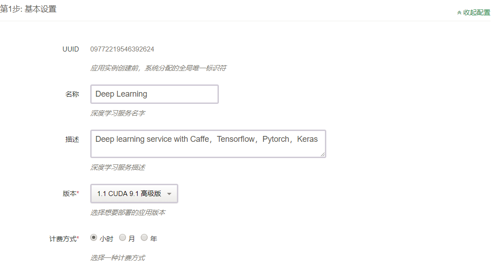

- 填写服务名称和描述，选择版本。

### 第2步：计算节点设置

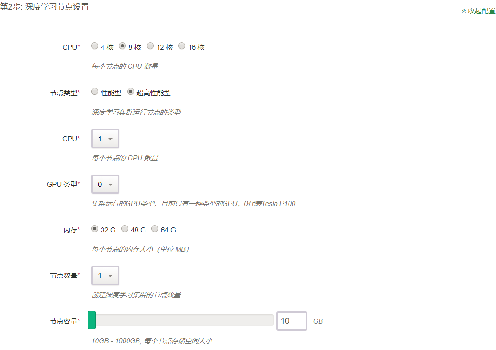

- 填写节点 CPU、GPU、内存、节点类型、节点个数、数据盘大小等配置信息。

### 第3步：网络设置


- 出于安全考虑，所有的集群都需要部署在私有网络中，选择自己创建的已连接路由器的私有网络中。

### 第4步：环境设置

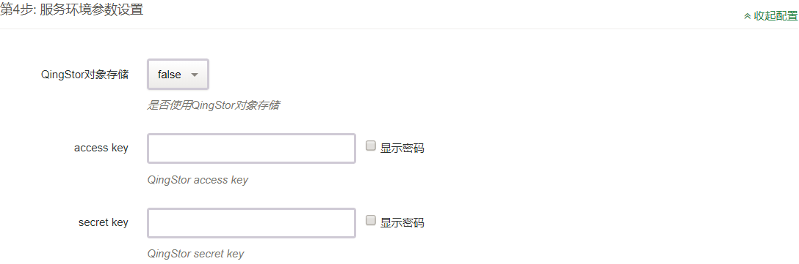

- Deep Learning app 与 QingStor 命令行工具集成，[配置 QingStor](https://docs.qingcloud.com/qingstor/developer_tools/qsctl.html) 相关参数，可以方便的从 QingStor 拉取数据。如果 QingStor 选用 false，access_key 和 secret_key 则无需填写。

## Deep Learning 测试

### 测试环境

深度学习平台使用 VirtualEnv 来管理 Python 环境，Python 的版本为 2.7 和 3.6 ，并装有 numpy，scipy，pandas，matplotlib，nltk，scikit-learn，jupyter notebook 等常用工具包。下面将以 MNIST 数据集为例，分别测试 Caffe，TensorFlow，PyTorch 和 Keras。

平台已经为用户安装好了Python 2.7和Python 3.6的VirtualEnv环境，并在其中预装了深度学习框架和常用工具包，放在ubuntu用户根目录的workspaces文件夹，py2和py3分别对应Python 2.7和3.6版本。用户登录后，使用如下命令激活和退出
```shell
source /home/ubuntu/workspaces/py2/bin/activate
deactivate
source /home/ubuntu/workspaces/py3/bin/activate
deactivate
```
VirtualEnv的激活和退出

> <span style="color:red">建议在任何框架上运行程序前都用如上方法选择 python 运行环境，安装和更新 python 库也在VirtualEnv中进行，保持系统自身 python 环境的清洁，并实现在同一个系统中不同版本的 python 和框架共存。</span>

> <span style="color:red">用户可以将自己常用环境的激活命令增加到.bashrc中，这样登录后即可自动激活对应版本python的运行环境。</span>

> <span style="color:red">在一个环境激活后，直接输入python命令即可运行对应版本的python，不需要显式指定python2或python3，输入命令前注意命令提示行开头小括号中的信息，py2和py3分别对应2.7和3.6版本的python。</span>

深度学习平台为用户准备了环境完整性测试样例，放在ubuntu用户根目录的test文件夹，使用MNIST数据集对Caffe，TensorFlow，PyTorch和Keras进行测试。
> [MNIST](http://yann.lecun.com/exdb/mnist/) 是著名的手写数字数据集，包含 0~9 十个各种风格的手写数字，经常用于深度学习入门及测试。其内容分为训练集和测试集，训练数据集包含 60,000 个样本，测试数据集包含 10,000 样本，数据集中的每张图片由 28x28 个像素点构成。

Deep Learning 训练往往需要大量的数据，数据存储经常占用很大的空间。青云 QingStor 可以存储海量数据，用户可以方便的把数据放在 QingStor，再使用 QingStor 命令行工具快速的下载到本地。如果在环境设置中配置好了 QingStor (如果没有也可在本地[配置](https://docs.qingcloud.com/qingstor/developer_tools/qsctl.html))，从 QingStor 获取数据：

```shell
cd /home/ubuntu/tensorflow
mkdir data
qsctl cp -r qs://mydata/ data/
```

> 节点登录信息：ubuntu/p12cHANgepwD

### Caffe 测试示例

Caffe 支持 Python 接口，深度学习平台已经提供，目前不支持多机分布式训练，详情请见 [Caffe 文档](http://caffe.berkeleyvision.org)。(**GPU和CPU版本App分别内置了不同版本的 Caffe ，请依据硬件情况选择需要部署的版本。**)

#### 单机

caffe单机示例：

```shell
cd /home/ubuntu/caffe-py2
./build/tools/caffe train --solver=examples/mnist/lenet_solver.prototxt
```

Caffe 训练过程


Caffe 训练结果
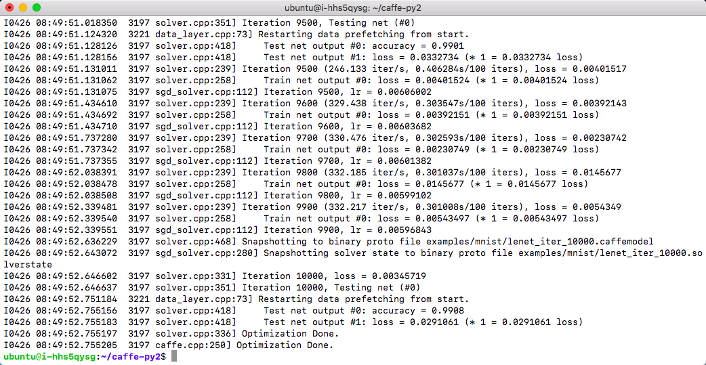

PyCaffe单机示例：

```shell
source /home/ubuntu/workspaces/py2/bin/activate
cd /home/ubuntu/test/pycaffe
python mnist.py
```
PyCaffe 训练过程


PyCaffe 训练结果
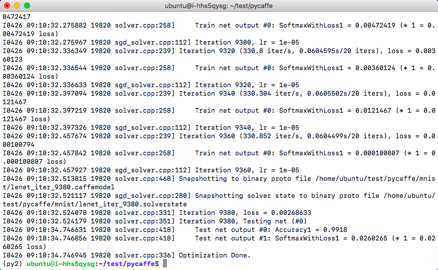

查看 GPU 使用情况，可以使用如下命令：

```shell
nvidia-smi
```

GPU 使用情况


### TensorFlow 测试示例

完整信息请见 [TensorFlow 文档](http://tensorflow.org)

#### 单机：

```shell
cd /home/ubuntu/test/tensorflow
python mnist.py
```
TensorFlow 训练过程

TensorFlow 训练结果
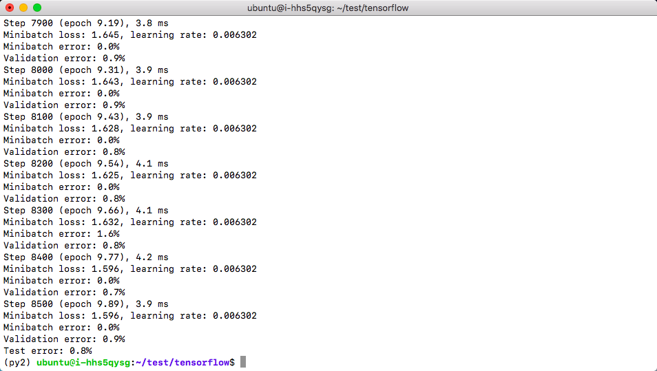

#### 分布式：

增加节点，在线扩容：在详情页点击 `新增节点` 按钮，可以对每个新增节点指定 IP 或选择自动分配。
TensorFlow 增加节点
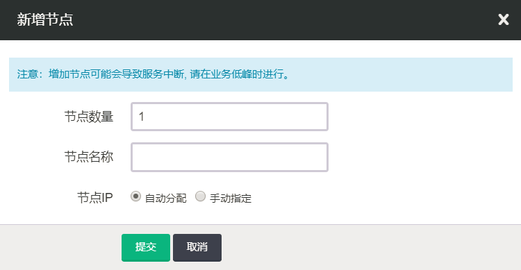

TensorFlow 分布式训练需要指定 parameter server 和 worker 的 IP 地址和端口号（根据自己的 IP 进行修改）
下面是一个 parameter server 和两个 worker 进行分布式训练的示例：  

节点 1：

- 启动 parameter server

```shell
cd /home/ubuntu/test/tensorflow
python mnist_dist.py --ps_hosts=192.168.1.6:2221 --worker_hosts=192.168.1.6:2223,192.168.1.7:2223 --job_name=ps --task_index=0
```

- 启动第一个 worker

```shell
cd /home/ubuntu/test/tensorflow
python mnist_dist.py --ps_hosts=192.168.1.6:2221 --worker_hosts=192.168.1.6:2223,192.168.1.7:2223 --job_name=worker --task_index=0
```

节点 2：

- 启动第二个 worker （**注意：是在第二个节点即新增节点上启动**）

```shell
cd /home/ubuntu/test/tensorflow
python mnist_dist.py --ps_hosts=192.168.1.6:2221 --worker_hosts=192.168.1.6:2223,192.168.1.7:2223 --job_name=worker --task_index=1
```
TensorFlow 分布式训练过程
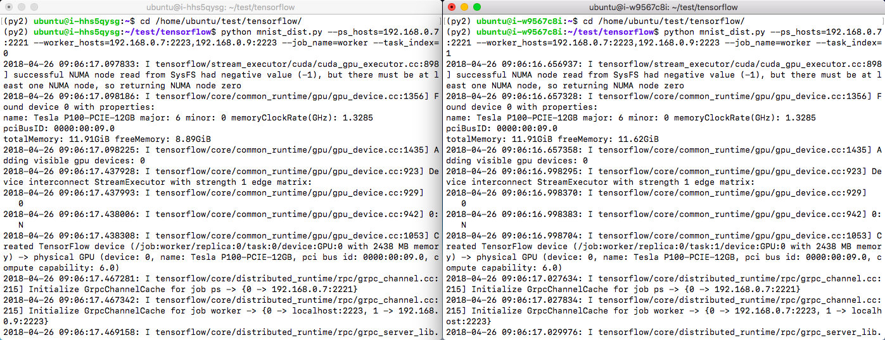
TensorFlow 分布式训练结果


#### 开启 TensorBoard 服务

TensorFlow 中的 TensorBoard 提供了训练过程中丰富的信息，默认端口号为 `6006`。在某一节点上启动一下命令：

```shell
tensorboard --logdir=./tflog/
```

TensorBoard 展示结果
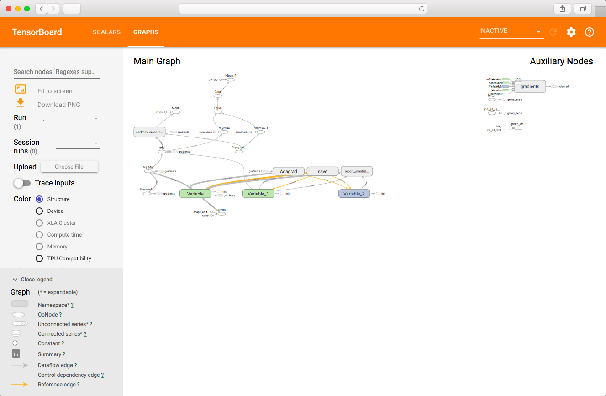

> 您可以通过如下方式之一查看 TensorBoard UI：
> 1. 如需在TensorBoard中显示相关信息，需要编写相关代码。TensorBoard详细用法请参考 [Github TensorBoard](https://github.com/tensorflow/tensorboard) 页面。
> 2. 通过公网访问，您需要先申请一个公网 IP 绑定在路由器上，在路由器上设置端口转发，同时打开防火墙相应的下行端口。
> 3. 或参考[VPN 隧道指南](https://docs.qingcloud.com/product/network/vpn#vpn) 配置 VPN，通过私网 IP 地址访问。

### PyTorch 测试示例

完整信息请见 [PyTorch文档](http://pytorch.org/)

#### 单机

```shell
cd /home/ubuntu/test/pytorch
python mnist.py
```

PyTorch 训练过程

PyTorch 训练结果
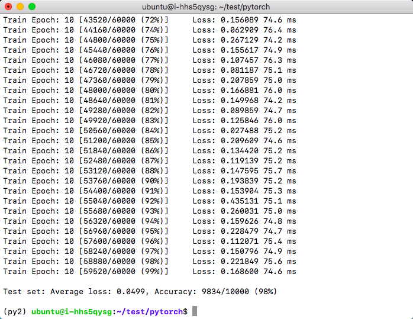

#### 分布式

> PyTorch 分布式训练时，由于当前版本的 PyTorch 尚未支持CPU分布式训练，请选择GPU版本进行分布式训练。

节点 1：

```shell
cd /home/ubuntu/test/pytorch
python mnist_dist.py
```

节点 2：

```shell
cd /home/ubuntu/test/pytorch
python mnist_dist.py
```

PyTorch 分布式训练过程
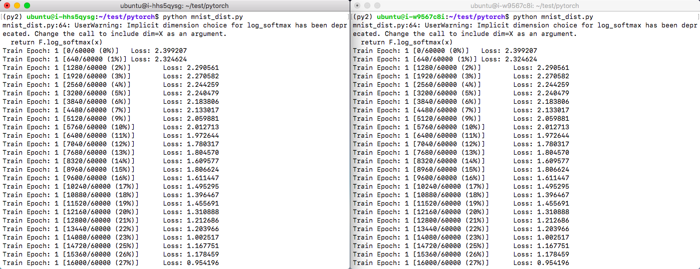
PyTorch 分布式训练结果


### Keras 测试示例

Keras 默认使用 TensorFlow 来计算，目前青云平台上也只支持 TensorFlow 作为其计算框架。详情请见 [Keras 文档](https://keras.io)

#### 单机

```shell
cd /home/ubuntu/keras
python mnist.py
```

Keras 训练过程

Keras 训练结果


为了方便开发，环境中配有 jupyter notebook，用户可以交互式编程，并能直观展现实时计算结果。
jupyter notebook 启动命令

```shell
cd /home/ubuntu/test/keras
jupyter notebook
```

新版本的jupyter notebook，需要在启动时配置IP地址参数，才能接收远程浏览器客户端的访问。启动命令如下，读取eth0的IP地址并设置到jupyter notebook

```shell
cd /home/ubuntu/test/keras
jupyter notebook --ip=`ifconfig eth0 2>/dev/null|awk '/inet addr:/ {print $2}'|sed 's/addr://'`
```

jupyter notebook 默认端口号为 `8888`，启动上述命令后会输出 token 信息，这个信息在下面访问 notebook 时候需要。
> 如果需要通过公网访问这些信息您需要先申请一个公网 IP 绑定在路由器上，在路由器上设置端口转发，同时打开防火墙相应的下行端口。为了方便使用 jupyter notebook，也可参考[VPN 隧道指南](https://docs.qingcloud.com/product/network/vpn#vpn) 配置 VPN。

jupyter notebook 开发环境浏览项目代码

jupyter notebook 开发环境运行项目
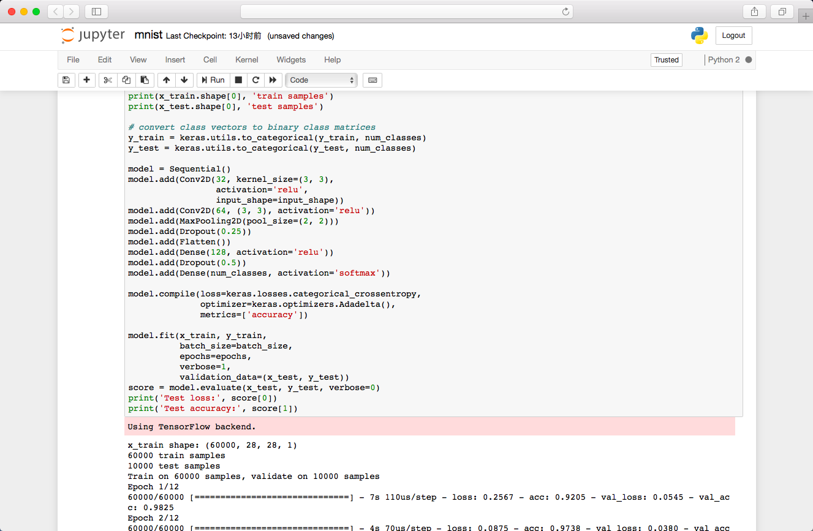

### 平台性能测试
为了让用户快速了解深度学习平台的性能指标以便于选择，我们使用 TensorFlow [性能测试代码](https://github.com/tensorflow/benchmarks)中的 CNN Benchmark ，对常用硬件配置组合进行了测试。
我们选择 ResNet-50 模型，调用平台预装的 Python 3.6 + TensorFlow 1.7.0 环境，使用合成数据进行测试。

青云深度学习平台组件版本对照表

App版本 | CPU | Memory | GPU | BatchSize | 项目 | Images/Sec (step time)
-------- | ----- | ----- | ----- | ----- | ----- | -----
CUDA 9.1 | 8核(默认) | 32G  | 1 | 64 | 训练 | 199.09 (5.02ms)
CUDA 9.1 | 8核(默认) | 32G  | 1 | 64 | 推理 | 632.51 (1.58ms)
CUDA 9.1 | 8核(默认) | 32G  | 2 | 64 | 训练 | 382.38 (2.62ms)
CUDA 9.1 | 8核(默认) | 32G  | 2 | 64 | 推理 | 1102.66 (0.91ms)
CPU (无优化) | 8核(默认) | 32G | 0 | 32 | 训练 | 1.91 (523.56ms)
CPU (无优化) | 8核(默认) | 32G | 0 | 32 | 推理 | 8.36 (119.62ms)
CPU (无优化) | 16核(默认) | 32G | 0 | 32 | 训练 | 2.62 (381.68ms)
CPU (无优化) | 16核(默认) | 32G | 0 | 32 | 推理 | 11.44 (87.41ms)
CPU (MKL优化) | 8核(Broadwell) | 32G | 0 | 32 | 训练 | 9.43 (106.04ms)
CPU (MKL优化) | 8核(Broadwell) | 32G | 0 | 32 | 推理 | 28.53 (35.05ms)
CPU (MKL优化) | 16核(Broadwell) | 32G | 0 | 32 | 训练 | 12.82 (78.00ms)
CPU (MKL优化) | 16核(Broadwell) | 32G | 0 | 32 | 推理 | 39.17 (25.53ms)

TensorFlow 官方性能测试情况，请参见
[官方GPU版性能测试](https://www.tensorflow.org/performance/benchmarks)
[官方CPU版性能测试](https://www.tensorflow.org/performance/performance_guide#optimizing_for_cpu)

> <span style="color:red">为了便于用户对比，我们选择和官方各项测试接近的硬件配置和相同的 BatchSize 。</span>

> <span style="color:red">因为 CPU 无优化版本仅支持 NHWC 数据格式，所以除了 CPU (无优化版)测试，其他测试中使用的数据格式均为 NCHW 。</span>

> <span style="color:red">CPU 版本测试中，使用常用优化方式，设置intra_op等于物理核个数，inter_op为2。参考[CPU优化参考](https://www.tensorflow.org/performance/performance_guide#optimizing_for_cpu)</span>

> <span style="color:red">目前 CPU 优化版本暂未上线。</span>

### 模型和数据
为了方便用户使用，我们收集了深度学习常用的数据集，以及一些常用模型的预训练权重，放在对象存储中，用户可直接使用这些数据开始自己的工作，节省下载数据的时间，提高工作效率。

#### 数据集

[ImageNet](http://www.image-net.org/)

名称 | 地址 | URL | 尺寸
-------- | ----- | ----- | -----
ILSVRC2017 Object localization dataset | [CLS-LOC dataset](https://appcenter-deeplearning.sh1a.qingstor.com/dataset/imagenet/ILSVRC2017_CLS-LOC.tar.gz) | https://appcenter-deeplearning.sh1a.qingstor.com/dataset/imagenet/ILSVRC2017_CLS-LOC.tar.gz | 155GB
ILSVRC2017 Object detection dataset | [DET dataset](https://appcenter-deeplearning.sh1a.qingstor.com/dataset/imagenet/ILSVRC2017_DET.tar.gz) | https://appcenter-deeplearning.sh1a.qingstor.com/dataset/imagenet/ILSVRC2017_DET.tar.gz | 55GB
ILSVRC2017 Object detection test dataset | [DET test dataset](https://appcenter-deeplearning.sh1a.qingstor.com/dataset/imagenet/ILSVRC2017_DET_test_new.tar.gz) | https://appcenter-deeplearning.sh1a.qingstor.com/dataset/imagenet/ILSVRC2017_DET_test_new.tar.gz | 428MB

[COCO](http://cocodataset.org)

名称 | 地址 | 数量/尺寸
-------- | ----- | -----
2017 Train Images | [https://appcenter-deeplearning.sh1a.qingstor.com/dataset/coco/train2017.zip](https://appcenter-deeplearning.sh1a.qingstor.com/dataset/coco/train2017.zip) | 118K/18GB
2017 Val images  | [https://appcenter-deeplearning.sh1a.qingstor.com/dataset/coco/val2017.zip](https://appcenter-deeplearning.sh1a.qingstor.com/dataset/coco/val2017.zip) | 5K/1GB
2017 Test images | [https://appcenter-deeplearning.sh1a.qingstor.com/dataset/coco/test2017.zip](https://appcenter-deeplearning.sh1a.qingstor.com/dataset/coco/test2017.zip) | 41K/6GB
2017 Unlabeled images | [https://appcenter-deeplearning.sh1a.qingstor.com/dataset/coco/unlabeled2017.zip](https://appcenter-deeplearning.sh1a.qingstor.com/dataset/coco/unlabeled2017.zip) | 123K/19GB
2017 Train/Val annotations | [https://appcenter-deeplearning.sh1a.qingstor.com/dataset/coco/annotations_trainval2017.zip](https://appcenter-deeplearning.sh1a.qingstor.com/dataset/coco/annotations_trainval2017.zip) | 241MB
2017 Stuff Train/Val annotations | [https://appcenter-deeplearning.sh1a.qingstor.com/dataset/coco/stuff_annotations_trainval2017.zip](https://appcenter-deeplearning.sh1a.qingstor.com/dataset/coco/stuff_annotations_trainval2017.zip) | 401MB
2017 Testing Image info | [https://appcenter-deeplearning.sh1a.qingstor.com/dataset/coco/image_info_test2017.zip](https://appcenter-deeplearning.sh1a.qingstor.com/dataset/coco/image_info_test2017.zip) | 1MB
2017 Unlabeled Image info | [https://appcenter-deeplearning.sh1a.qingstor.com/dataset/coco/image_info_unlabeled2017.zip](https://appcenter-deeplearning.sh1a.qingstor.com/dataset/coco/image_info_unlabeled2017.zip) | 4MB

[PASCAL VOC](http://host.robots.ox.ac.uk/pascal/VOC)

名称 | 地址 | 尺寸
-------- | ----- | -----
VOC2012 training/validation data | [https://appcenter-deeplearning.sh1a.qingstor.com/dataset/voc/2012/VOCtrainval_11-May-2012.tar](https://appcenter-deeplearning.sh1a.qingstor.com/dataset/voc/2012/VOCtrainval_11-May-2012.tar) | 1.86GB
VOC2012 test data | [https://appcenter-deeplearning.sh1a.qingstor.com/dataset/voc/2012/VOC2012test.tar](https://appcenter-deeplearning.sh1a.qingstor.com/dataset/voc/2012/VOC2012test.tar) | 1.72GB
VOC2012 development kit code and documentation | [https://appcenter-deeplearning.sh1a.qingstor.com/dataset/voc/2012/VOCdevkit_18-May-2011.tar](https://appcenter-deeplearning.sh1a.qingstor.com/dataset/voc/2012/VOCdevkit_18-May-2011.tar) | 500KB
VOC2012 PDF documentation | [https://appcenter-deeplearning.sh1a.qingstor.com/dataset/voc/2012/devkit_doc.pdf](https://appcenter-deeplearning.sh1a.qingstor.com/dataset/voc/2012/devkit_doc.pdf) | 416KB
VOC2007 training/validation data | [https://appcenter-deeplearning.sh1a.qingstor.com/dataset/voc/2007/VOCtrainval_06-Nov-2007.tar](https://appcenter-deeplearning.sh1a.qingstor.com/dataset/voc/2007/VOCtrainval_06-Nov-2007.tar) | 439MB
VOC2007 test data | [https://appcenter-deeplearning.sh1a.qingstor.com/dataset/voc/2007/VOCtest_06-Nov-2007.tar](https://appcenter-deeplearning.sh1a.qingstor.com/dataset/voc/2007/VOCtest_06-Nov-2007.tar) | 430MB
VOC2007 development kit code and documentation | [https://appcenter-deeplearning.sh1a.qingstor.com/dataset/voc/2007/VOCdevkit_08-Jun-2007.tar](https://appcenter-deeplearning.sh1a.qingstor.com/dataset/voc/2007/VOCdevkit_08-Jun-2007.tar) | 250KB
VOC2007 PDF documentation | [https://appcenter-deeplearning.sh1a.qingstor.com/dataset/voc/2007/devkit_doc_07-Jun-2007.pdf](https://appcenter-deeplearning.sh1a.qingstor.com/dataset/voc/2007/devkit_doc_07-Jun-2007.pdf) | 175KB

[OpenSLR](http://www.openslr.org)

Name | Category | Summary | Files
-------- | ----- | ----- | -----
Vystadial | Speech | English and Czech data, mirrored from the Vystadial project | [data_voip_cs.tgz [1.5G]](https://appcenter-deeplearning.sh1a.qingstor.com/dataset/openslr/Vystadial/data_voip_cs.tgz)<br>[data_voip_en.tgz [2.7G]](https://appcenter-deeplearning.sh1a.qingstor.com/dataset/openslr/Vystadial/data_voip_en.tgz)
TED-LIUM | Speech | English speech recognition training corpus from TED talks, created by Laboratoire d’Informatique de l’Université du Maine (LIUM) (mirrored here) | [TEDLIUM_release1.tar.gz [21G]](https://appcenter-deeplearning.sh1a.qingstor.com/dataset/openslr/TED-LIUM/TEDLIUM_release1.tar.gz)
THCHS-30 | Speech | A Free Chinese Speech Corpus Released by CSLT@Tsinghua University | [data_thchs30.tgz [6.4G]](https://appcenter-deeplearning.sh1a.qingstor.com/dataset/openslr/THCHS-30/data_thchs30.tgz)<br>[test-noise.tgz [1.9G]](https://appcenter-deeplearning.sh1a.qingstor.com/dataset/openslr/THCHS-30/test-noise.tgz)<br>[resource.tgz [24M]](https://appcenter-deeplearning.sh1a.qingstor.com/dataset/openslr/THCHS-30/resource.tgz)
Aishell | Speech | Mandarin data, provided by Beijing Shell Shell Technology Co.,Ltd | [data_aishell.tgz [15G]](https://appcenter-deeplearning.sh1a.qingstor.com/dataset/openslr/Aishell/data_aishell.tgz)<br>[resource_aishell.tgz [1.2M]](https://appcenter-deeplearning.sh1a.qingstor.com/dataset/openslr/Aishell/resource_aishell.tgz)
Free ST Chinese Mandarin Corpus | Speech | A free Chinese Mandarin corpus by Surfingtech (www.surfing.ai), containing utterances from 855 speakers, 102600 utterances; | [ST-CMDS-20170001_1-OS.tar.gz [8.2G]](https://appcenter-deeplearning.sh1a.qingstor.com/dataset/openslr/Free%20ST%20Chinese%20Mandarin%20Corpus/ST-CMDS-20170001_1-OS.tar.gz)

#### 预训练模型

[TensorFlow-Slim image classification model library](https://github.com/tensorflow/models/tree/master/research/slim)

<span style="color:red">下表中 Checkpoint 地址均为青云对象存储地址，可直接下载。</span>

Model | TF-Slim File | Checkpoint | Top-1 Accuracy | Top-5 Accuracy
-------- | ----- | ----- | ----- | -----
[Inception V1](http://arxiv.org/abs/1409.4842v1) | [Code](https://github.com/tensorflow/models/blob/master/research/slim/nets/inception_v1.py) | [inception_v1_2016_08_28.tar.gz](https://appcenter-deeplearning.sh1a.qingstor.com/models/TensorFlow-Slim%20image%20classification/inception_v1_2016_08_28.tar.gz) | 69.8 | 89.6
[Inception V2](http://arxiv.org/abs/1502.03167) | [Code](https://github.com/tensorflow/models/blob/master/research/slim/nets/inception_v2.py) | [inception_v2_2016_08_28.tar.gz](https://appcenter-deeplearning.sh1a.qingstor.com/models/TensorFlow-Slim%20image%20classification/inception_v1_2016_08_28.tar.gz) | 73.9 | 91.8
[Inception V3](http://arxiv.org/abs/1512.00567) | [Code](https://github.com/tensorflow/models/blob/master/research/slim/nets/inception_v3.py) | [inception_v3_2016_08_28.tar.gz](https://appcenter-deeplearning.sh1a.qingstor.com/models/TensorFlow-Slim%20image%20classification/inception_v3_2016_08_28.tar.gz) | 78.0 | 93.9
[Inception V4](http://arxiv.org/abs/1602.07261) | [Code](https://github.com/tensorflow/models/blob/master/research/slim/nets/inception_v4.py) | [inception_v4_2016_09_09.tar.gz](https://appcenter-deeplearning.sh1a.qingstor.com/models/TensorFlow-Slim%20image%20classification/inception_v4_2016_09_09.tar.gz) | 80.2 | 95.2
[Inception-ResNet-v2](http://arxiv.org/abs/1602.07261) | [Code](https://github.com/tensorflow/models/blob/master/research/slim/nets/inception_resnet_v2.py) | [inception_resnet_v2_2016_08_30.tar.gz](https://appcenter-deeplearning.sh1a.qingstor.com/models/TensorFlow-Slim%20image%20classification/inception_resnet_v2_2016_08_30.tar.gz) | 80.4 | 95.3
[ResNet V1 50](https://arxiv.org/abs/1512.03385) | [Code](https://github.com/tensorflow/models/blob/master/research/slim/nets/resnet_v1.py) | [resnet_v1_50_2016_08_28.tar.gz](https://appcenter-deeplearning.sh1a.qingstor.com/models/TensorFlow-Slim%20image%20classification/resnet_v1_50_2016_08_28.tar.gz) | 75.2 | 92.2
[ResNet V1 101](https://arxiv.org/abs/1512.03385) | [Code](https://github.com/tensorflow/models/blob/master/research/slim/nets/resnet_v1.py) | [resnet_v1_101_2016_08_28.tar.gz](https://appcenter-deeplearning.sh1a.qingstor.com/models/TensorFlow-Slim%20image%20classification/resnet_v1_101_2016_08_28.tar.gz) | 76.4 | 92.9
[ResNet V1 152](https://arxiv.org/abs/1512.03385) | [Code](https://github.com/tensorflow/models/blob/master/research/slim/nets/resnet_v1.py) | [resnet_v1_152_2016_08_28.tar.gz](https://appcenter-deeplearning.sh1a.qingstor.com/models/TensorFlow-Slim%20image%20classification/resnet_v1_152_2016_08_28.tar.gz) | 76.8 | 93.2
[ResNet V2 50](https://arxiv.org/abs/1603.05027) | [Code](https://github.com/tensorflow/models/blob/master/research/slim/nets/resnet_v2.py) | [resnet_v2_50_2017_04_14.tar.gz](https://appcenter-deeplearning.sh1a.qingstor.com/models/TensorFlow-Slim%20image%20classification/resnet_v2_50_2017_04_14.tar.gz) | 75.6 | 92.8
[ResNet V2 101](https://arxiv.org/abs/1603.05027) | [Code](https://github.com/tensorflow/models/blob/master/research/slim/nets/resnet_v2.py) | [resnet_v2_101_2017_04_14.tar.gz](https://appcenter-deeplearning.sh1a.qingstor.com/models/TensorFlow-Slim%20image%20classification/resnet_v2_101_2017_04_14.tar.gz) | 77.0 | 93.7
[ResNet V2 152](https://arxiv.org/abs/1603.05027) | [Code](https://github.com/tensorflow/models/blob/master/research/slim/nets/resnet_v2.py) | [resnet_v2_152_2017_04_14.tar.gz](https://appcenter-deeplearning.sh1a.qingstor.com/models/TensorFlow-Slim%20image%20classification/resnet_v2_152_2017_04_14.tar.gz) | 77.8 | 94.1
[VGG 16](http://arxiv.org/abs/1409.1556.pdf) | [Code](https://github.com/tensorflow/models/blob/master/research/slim/nets/vgg.py) | [vgg_16_2016_08_28.tar.gz](https://appcenter-deeplearning.sh1a.qingstor.com/models/TensorFlow-Slim%20image%20classification/vgg_16_2016_08_28.tar.gz) | 71.5 | 89.8
[VGG 19](http://arxiv.org/abs/1409.1556.pdf) | [Code](https://github.com/tensorflow/models/blob/master/research/slim/nets/vgg.py) | [vgg_19_2016_08_28.tar.gz](https://appcenter-deeplearning.sh1a.qingstor.com/models/TensorFlow-Slim%20image%20classification/vgg_19_2016_08_28.tar.gz) | 71.1 | 89.8
[MobileNet_v1_1.0_224](https://arxiv.org/pdf/1704.04861.pdf) | [Code](https://github.com/tensorflow/models/blob/master/research/slim/nets/mobilenet_v1.py) | [mobilenet_v1_1.0_224.tgz](https://appcenter-deeplearning.sh1a.qingstor.com/models/TensorFlow-Slim%20image%20classification/mobilenet_v1_1.0_224.tgz) | 70.9 | 89.9
[MobileNet_v1_0.50_160](https://arxiv.org/pdf/1704.04861.pdf) | [Code](https://github.com/tensorflow/models/blob/master/research/slim/nets/mobilenet_v1.py) | [mobilenet_v1_0.5_160.tgz](https://appcenter-deeplearning.sh1a.qingstor.com/models/TensorFlow-Slim%20image%20classification/mobilenet_v1_0.5_160.tgz) | 59.1 | 81.9
[MobileNet_v1_0.25_128](https://arxiv.org/pdf/1704.04861.pdf) | [Code](https://github.com/tensorflow/models/blob/master/research/slim/nets/mobilenet_v1.py) | [mobilenet_v1_0.25_128.tgz](https://appcenter-deeplearning.sh1a.qingstor.com/models/TensorFlow-Slim%20image%20classification/mobilenet_v1_0.25_128.tgz) | 41.5 | 66.3
[MobileNet_v2_1.4_224](https://arxiv.org/abs/1801.04381) | [Code](https://github.com/tensorflow/models/blob/master/research/slim/nets/mobilenet/mobilenet_v2.py) | [mobilenet_v2_1.4_224.tgz](https://appcenter-deeplearning.sh1a.qingstor.com/models/TensorFlow-Slim%20image%20classification/mobilenet_v2_1.4_224.tgz) | 74.9 | 92.5
[MobileNet_v2_1.0_224](https://arxiv.org/abs/1801.04381) | [Code](https://github.com/tensorflow/models/blob/master/research/slim/nets/mobilenet/mobilenet_v2.py) | [mobilenet_v2_1.0_224.tgz](https://appcenter-deeplearning.sh1a.qingstor.com/models/TensorFlow-Slim%20image%20classification/mobilenet_v2_1.0_224.tgz) | 71.9 | 91.0
[NASNet-A_Mobile_224](https://arxiv.org/abs/1707.07012) | [Code](https://github.com/tensorflow/models/blob/master/research/slim/nets/nasnet/nasnet.py) | [nasnet-a_mobile_04_10_2017.tar.gz](https://appcenter-deeplearning.sh1a.qingstor.com/models/TensorFlow-Slim%20image%20classification/nasnet-a_mobile_04_10_2017.tar.gz) | 74.0 | 91.6
[NASNet-A_Large_331](https://arxiv.org/abs/1707.07012) | [Code](https://github.com/tensorflow/models/blob/master/research/slim/nets/nasnet/nasnet.py) | [nasnet-a_large_04_10_2017.tar.gz](https://appcenter-deeplearning.sh1a.qingstor.com/models/TensorFlow-Slim%20image%20classification/nasnet-a_large_04_10_2017.tar.gz) | 82.7 | 96.2
[PNASNet-5_Large_331](https://arxiv.org/abs/1712.00559) | [Code](https://github.com/tensorflow/models/blob/master/research/slim/nets/nasnet/pnasnet.py) | [pnasnet-5_large_2017_12_13.tar.gz](https://appcenter-deeplearning.sh1a.qingstor.com/models/TensorFlow-Slim%20image%20classification/pnasnet-5_large_2017_12_13.tar.gz) | 82.9 | 96.2

#### 训练和推理
##### 图像分类模型
Inception V1的训练和测试
为了方便用户测试和使用，我们选择了Google的Inception v1(GoogLeNet)，对30幅猫和狗的图片进行简要的训练和推理测试(因为只使用30幅图片进行快速演示，所以未设置验证和测试图片，使用训练图片进行推理，简明验证权重和BatchNormalization等参数的保存)，能够在几分钟内完成从头训练(Train from scratch)，保存权重，加载训练的权重进行推理等整个流程环节。并使用相同的代码，加载Google发布在Tensorflow工程中的预训练权重，测试对图片的推理。用户通过这个示例，能够快速了解平台并部署自己的深度学习模型。
测试步骤如下：
下载测试代码并解压
```shell
cd /home/ubuntu
wget https://appcenter-deeplearning.sh1a.qingstor.com/models/Slim-InceptionV1.tar
tar xvf https://appcenter-deeplearning.sh1a.qingstor.com/models/Slim-InceptionV1.tar
cd Slim-InceptionV1
```
激活VirtualEnv
```shell
source /home/ubuntu/workspaces/py2/bin/activate
```

训练30幅图片的猫狗2分类
```shell
python train.py
```
训练在GPU上会在1分钟内完成，如下
Inception v1 训练过程

Inception v1 训练结果


使用刚才训练的权重对图片进行推理
```shell
python test.py picture/dog/dog1.jpg
python test.py picture/cat/cat1.jpg
```
从结果可以看出，保存的权重对图片进行了较好的2分类。
Inception v1 推理
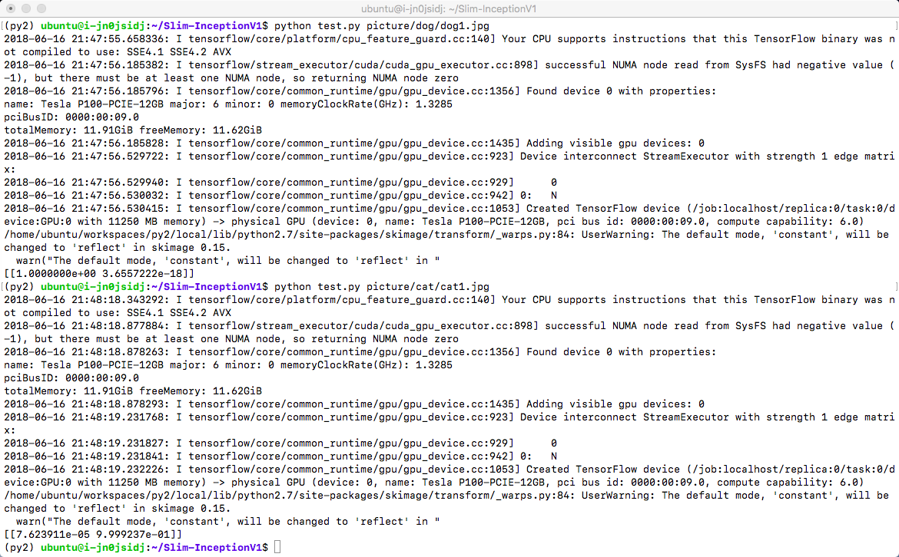

使用预训练权重对图片进行推理
刚才使用的只是2分类的自己训练的权重，也可以直接使用Google发布在Tensorflow工程中使用ImageNet训练的1000分类预训练权重，或者基于这个预训练结果进行迁移学习。这里简要演示使用预训练权重推理的过程
下载并解压预训练权重
```shell
wget https://appcenter-deeplearning.sh1a.qingstor.com/models/TensorFlow-Slim%20image%20classification/inception_v1_2016_08_28.tar.gz
tar xvf inception_v1_2016_08_28.tar.gz
```
使用预训练权重进行推理
```shell
python test_pretrained.py picture/dog/dog2.jpg
python test_pretrained.py picture/cat/cat2.jpg
```
这里加载了ImageNet的标签文本，并依据SoftMax结果输出标签值，所以可以显示出图像分类的文本结果
Inception v1 使用预训练权重推理


## 版本历史

### v1.0

- 初始版本

### v1.1

- 区分CUDA 8.0， CUDA 9.1 和 CPU 版本
- 更新深度学习框架版本