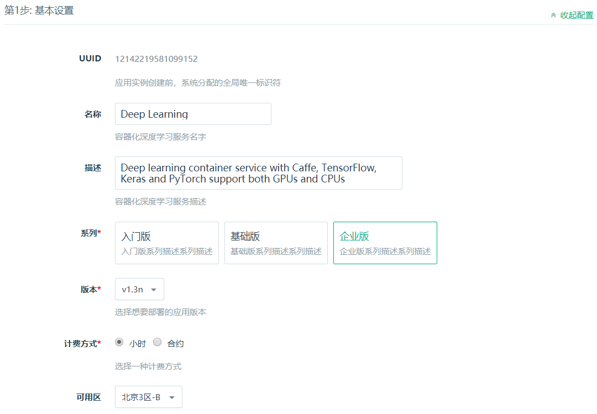
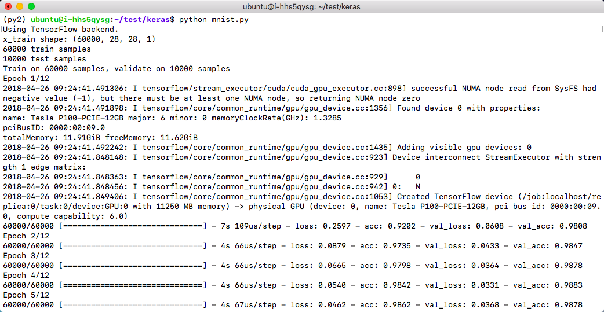
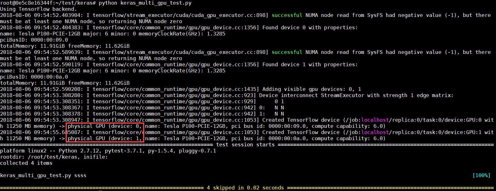
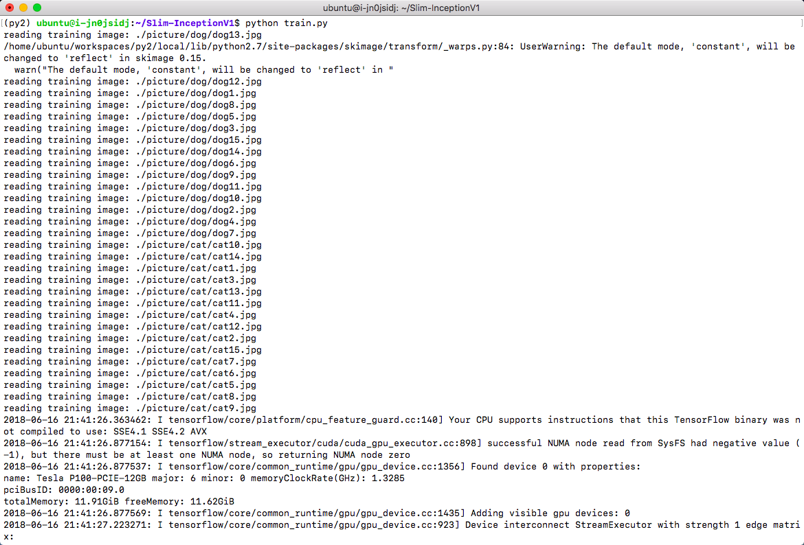
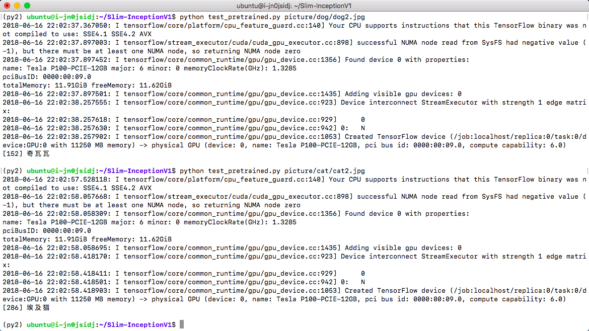
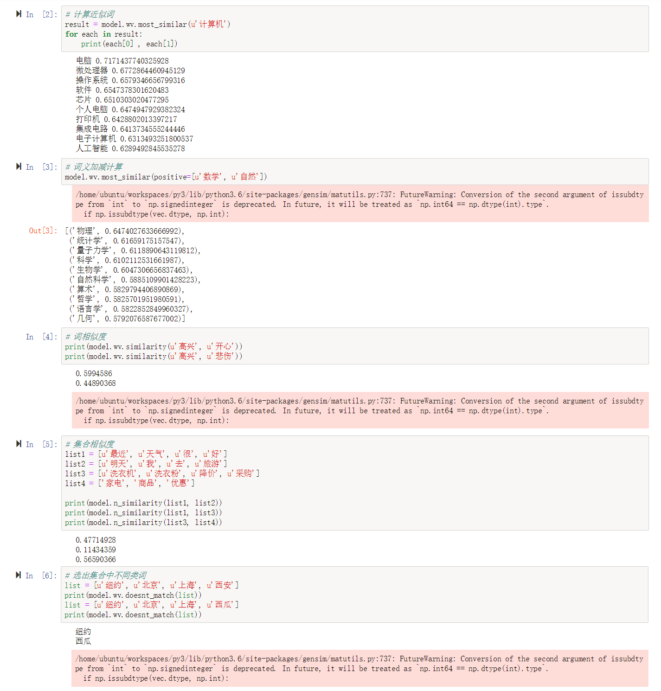
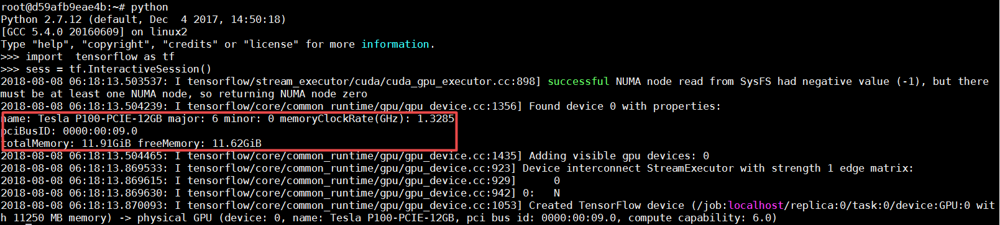

---
---

# Deep Learning on QingCloud AppCenter 用户指南


## 深度学习简介

2016 年 AlphaGo 战胜李世石，预示我们进入了 AI 时代。深度学习是 AI 的核心技术，在图像分类，自然语言处理，无人驾驶等众多领域显示出了强大的能力，各大巨头纷纷投入巨资研发。语音助手，人脸识别，外文翻译等等，AI 已融入到了我们生活的方方面面，极大了促进了社会的发展。其中 Caffe，TensorFlow，Keras，PyTorch 是主流的深度学习框架，拥有强大的社区支持，是实践深度学习不可或缺的工具。

### Caffe

Caffe 是一个被广泛使用的深度学习框架，由 BVLC 开发。Caffe 容易上手，训练速度快，组件模块化，并拥有大量训练好的经典模型。Caffe 在 GPU 上训练的性能很好，但只能支持单机多 GPU 的训练，不支持分布式多机训练。

### TensorFlow

TensorFlow 由 Google 大脑主导开发，是一个分布式系统上的大规模深度学习框架。移植性好，可以运行在移动设备上，并支持分布式多机多卡训练，支持多种深度学习模型。TensorFlow 还有功能强大的可视化组件 TensorBoard，能可视化网络结构和训练过程，对于观察复杂的网络结构和监控长时间、大规模的训练很有帮助。

### PyTorch

PyTorch 从 Torch 发展而来，并经过了大量改进，由 FaceBook AI 团队主导开发。不同于 TensorFlow，PyTorch 采用动态计算图的方式，并提供良好的 Python 接口，代码简单灵活，使用起来非常方便。内存分配也经过了优化，能支持分布式多机训练。

### Keras

Keras 是一个高层神经网络 API，由 Python 编写，通过调用其他深度学习框架来进行计算，如 TensorFlow、 Theano 以及 CNTK。 Keras 高度模块化，能快速搭建神经网络，并且非常容易上手。

> <span style="color:red">目前仅 pek3a , pek3b , sh1a 支持 GPU，如需在其他区创建请选择CPU版。TensorFlow，Caffe ， PyTorch 和 Keras 均支持用 CPU 进行深度学习应用的训练和测试。</span>

本说明文档仅对应青云深度学习平台1.2版本，1.1版本说明文档请参考[青云深度学习平台1.1](./1.1)。

## 青云深度学习平台(非容器版)

基于青云提供的 NVIDIA Tesla P100 GPU，青云深度学习平台提供了 CUDA9.1 + cuDNN7.1.3 ， CUDA8.0 + cuDNN7.1.3 和 CPU 等3套配置，并安装了流行的深度学习框架，如 TensorFlow(1.8.0/1.6.0)，Caffe(BVLC/Intel)，PyTorch(0.4.0/0.3.1)，Keras(2.2.0)，省去了用户搭建环境的麻烦，提高开发效率。用户无需修改代码，即可把本地的代码运行在云上，还能动态扩展所需资源。
青云深度学习平台组件版本对照表

App版本 | TensorFlow | Caffe | PyTorch | Keras
-------- | ----- | ----- | ----- | -----
CUDA 9.1 | 1.8.0 | BVLC  | 0.4.0 | 2.2.0
CUDA 8.0 | 1.6.0 | BVLC  | 0.3.1 | 2.2.0
CPU      | 1.8.0 | Intel | 0.3.1 | 2.2.0

为了满足用户对 TensorFlow 不同版本的需求，青云深度学习平台提供了 TensorFlow 其他版本编译好的wheel包，可从对象存储下载，下载地址请参考[TensorFlow 安装包下载](https://docs.qingcloud.com/product/ai/deeplearning/#tensorflow-%E5%AE%89%E8%A3%85%E5%8C%85%E4%B8%8B%E8%BD%BD)。

更换TensorFlow版本的方法如下
```shell
# 激活需要更换版本的VirtualEnv（这里以python 2.7为例）
source /home/ubuntu/workspaces/py2/bin/activate
# 卸载当前版本的 Tensorflow 和 TensorBoard（因为 TensorBoard 和 TensorFlow 互相配合，所以最好一起卸载）
pip uninstall tensorflow
pip uninstall tensorboard
# 下载并安装其他版本TensorFlow（安装 TensorFlow 的同时会从 pip 源自动下载安装对应版本的 TensorBoard）
wget https://appcenter-deeplearning.sh1a.qingstor.com/tensorflow/1.9.0/gpu/tensorflow-1.9.0-cp27-cp27mu-linux_x86_64.whl
pip install tensorflow-1.9.0-cp27-cp27mu-linux_x86_64.whl
# 安装完成后，用 pip list 检查当前安装所有包的版本
pip list
```

## 青云深度学习平台(容器版)
深度学习平台（容器版）基于Docker容器技术，将主流的深度学习框架做成docker镜像的形式，用户无需为环境进行繁琐的配置，直接运行容器化的深度学习应用，即可迅速开展训练和预测任务，提高了用户的开发和部署效率。
青云深度学习平台（容器版）提供GPU和CPU两个容器版本，其中GPU版本分为GPU高级版和GPU基础版，均搭载NVIDIA Tesla P100 GPU，GPU高级版和GPU基础版的区别在于CPU核数、内存的可配置范围以及是否支持包年包月。GPU容器版在docker宿主机中安装NVIDIA Driver(387.26)，nvidia-docker2，Docker(18.03.1-ce)，CPU容器版在docker宿主机上安装Docker(18.03.1-ce)，容器版在宿主机上预置了一个或多个docker镜像，镜像中均安装Caffe(1.0)，TensorFlow(1.8.0)，Keras(2.2.0)，PyTorch(0.4.1)框架。

- 容器版的内置镜像

|容器版类别	|Python版本	|CUDA版本	|内置镜像	|描述  |
| :-------- | :--------:| :--: | :--|:--|
|GPU 容器高级版|2.7|9.1|qingcloud/deeplearning:1.0-py27-cu91-cudnn7.1|GPU 训练，CUDA 和 cuDNN 加速|
|GPU 容器基础版|2.7|9.1|qingcloud/deeplearning:1.0-py27-cu91-cudnn7.1|GPU 训练，CUDA 和 cuDNN 加速|
|CPU 优化容器版|2.7|-|qingcloud/deeplearning:1.0-py27-cpu|Intel CPU 无优化训练|
|CPU 优化容器版|2.7|-|qingcloud/deeplearning:1.0-py27-cpu-avx|Intel CPU 优化，AVX指令集加速|
|CPU 优化容器版|2.7|-|qingcloud/deeplearning:1.0-py27-cpu-avx2-mkldnn|Intel CPU 优化，AVX 指令集和 MKLDNN库加速|

> <span style="color:red"> CPU 优化容器版内置3个镜像，其中有两个为 Intel CPU 优化镜像(1.0-py27-cpu-avx 和 1.0-py27-cpu-avx2-mkldnn)，只有CPU架构为 SandyBridge, IvyBridge, Haswell, Broadwell 才可以使用优化版镜像，CPU 容器版镜像与 CPU 微架构的适配情况见[CPU容器版镜像与CPU微架构适配表](https://docs.qingcloud.com/product/ai/deeplearning/#CPU%E5%AE%B9%E5%99%A8%E7%89%88%E9%95%9C%E5%83%8F%E4%B8%8ECPU%E5%BE%AE%E6%9E%B6%E6%9E%84%E9%80%82%E9%85%8D%E8%A1%A8)</span>

为满足用户对不同Deep Learning框架版本、Python版本和CUDA版本的需求，青云深度学习平台（容器版）提供了匹配不同版本的多个[docker image](https://hub.docker.com/u/qingcloud/)，用户可依据需要拉取，多个版本的docker image以及获取命令见[image获取命令](https://docs.qingcloud.com/product/ai/deeplearning/#docker%E9%95%9C%E5%83%8F%E8%8E%B7%E5%8F%96%E5%91%BD%E4%BB%A4)

- 各深度学习框架的Repository地址

|深度学习框架	|Repository地址	|
| :-------- | :--|
|TensorFlow|https://hub.docker.com/r/qingcloud/tensorflow/|
|Keras|https://hub.docker.com/r/qingcloud/keras/|
|Pytorch|https://hub.docker.com/r/qingcloud/pytorch/|
|Caffe|https://hub.docker.com/r/qingcloud/caffe/|
|TensorFlow+Keras+Pytorch+Caffe|https://hub.docker.com/r/qingcloud/deeplearning/|

## 部署 Deep Learning 服务

### 第1步：进入AppCenter，选择Deep Learning on QingCloud服务


### 第2步：部署Deep Learning应用


### 第3步：选择GPU可用区


> 红色框所示的区域表示GPU可用区，若您需要使用GPU，只能从这三个区域中选择，所有区域均支持CPU训练。

### 第4步：基本设置



- 填写服务名称和描述，选择版本。

### 第5步：计算节点设置

- 若选择 GPU 版本，填写节点 CPU cores、 GPU 个数、内存大小、节点类型、节点个数、数据盘大小等配置信息。


- 若选择 CPU 版本，填写 CPU 微架构类型、节点 CPU cores、内存大小、节点类型、节点个数、数据盘大小等配置信息。


> <span style="color:red"> 建议用户选择最新的 CPU 微架构，深度学习平台提供的 CPU 微架构按照新旧排序为：平台默认 -> Westmere -> SandyBridge -> IvyBridge -> Haswell -> Broadwell， 只有CPU微架构在SandyBridge及以上才可以使用优化版镜像，CPU 容器版镜像（含优化版镜像）与 CPU 微架构的适配情况见[CPU容器版镜像与CPU微架构适配表](https://docs.qingcloud.com/product/ai/deeplearning/#CPU%E5%AE%B9%E5%99%A8%E7%89%88%E9%95%9C%E5%83%8F%E4%B8%8ECPU%E5%BE%AE%E6%9E%B6%E6%9E%84%E9%80%82%E9%85%8D%E8%A1%A8)</span>

### 第6步：网络设置


- 出于安全考虑，所有的集群都需要部署在私有网络中，选择自己创建的已连接路由器的私有网络中。

### 第7步：环境设置


- Deep Learning app 与 QingStor 命令行工具集成，[配置 QingStor](https://docs.qingcloud.com/qingstor/developer_tools/qsctl.html) 相关参数，可以方便的从 QingStor 拉取数据。如果 QingStor 选用 false，access_key 和 secret_key 则无需填写。

### 第8步：查看GPU监控信息

集群启动5分钟后，依次进入QingCloud控制台->AppCenter->管理，便可以看到主机的运行状态和GPU监控信息

- 运行状态


- GPU的监控


### 第9步：登录主机

- 登录账号：**ubuntu**，登录初始密码：**p12cHANgepwD**
- 配置 VPN，并通过私网 IP 地址访问。参考[VPN 隧道指南](https://docs.qingcloud.com/product/network/vpn#vpn) 配置 VPN，建议使用 VPN 方式，安全性较高；
- 若Deep Learning主机所在的VPC私有网络的路由器没有绑定公网IP，则可以在[青云控制台](https://console.qingcloud.com)提供的web终端登录；
- 若Deep Learning主机所在的VPC私有网络的路由器绑定了公网IP，则可以在VPC网络的路由器上[配置端口转发策略](https://docs.qingcloud.com/product/network/appcenter_network_config/config_portmapping.html)，间接通过ssh客户端登录。

> 为保障主机安全，建议登陆之后更换成ssh秘钥登录方式，修改ssh服务禁止密码登录。修改方法：`vi /etc/ssh/sshd_config`，将`PasswordAuthentication`设置为`no`，重启ssh服务：`sudo service ssd restart`，
> 由于端口转发带来的安全隐患，不建议采用端口转发方式登录主机

## 升级 Deep Learning App
如果您正在使用Deep Learning 1.1 版本，界面中将会出现提示升级的按钮

关闭集群后，点击菜单中的“升级”按钮即可升级，升级过程中，仅 /data 目录下的文件能够保留，如果您在其他目录下存放了数据文件，请务必复制到 /data 目录、或者保存到对象存储等其他存储位置，再进行升级操作。


> <span style="color:red"> 升级注意： 升级过程中，仅 /data 目录下的文件能够保留，如果您在其他目录下存放了数据文件，请务必复制到 /data 目录、或者保存到对象存储等其他存储位置，再进行升级操作。 </span>

## 深度学习平台使用指南

### 启动环境

#### 非容器版：激活VirtualEnv

非容器版深度学习平台使用 VirtualEnv 来管理 Python 环境，Python 的版本为 2.7 和 3.6 ，并装有 numpy，scipy，pandas，matplotlib，nltk，scikit-learn，jupyter notebook 等常用工具包。下面将以 MNIST 数据集为例，分别测试 Caffe，TensorFlow，PyTorch 和 Keras。

平台已经为用户安装好了Python 2.7和Python 3.6的VirtualEnv环境，并在其中预装了深度学习框架和常用工具包，放在ubuntu用户根目录的workspaces文件夹，py2和py3分别对应Python 2.7和3.6版本。用户登录后，使用如下命令激活和退出
```shell
source /home/ubuntu/workspaces/py2/bin/activate
deactivate
source /home/ubuntu/workspaces/py3/bin/activate
deactivate
```
VirtualEnv的激活和退出

> <span style="color:red">建议在任何框架上运行程序前都用如上方法选择 python 运行环境，安装和更新 python 库也在VirtualEnv中进行，保持系统自身 python 环境的清洁，并实现在同一个系统中不同版本的 python 和框架共存。</span>

> <span style="color:red">用户可以将自己常用环境的激活命令增加到.bashrc中，这样登录后即可自动激活对应版本python的运行环境。</span>

> <span style="color:red">在一个环境激活后，直接输入python命令即可运行对应版本的python，不需要显式指定python2或python3，输入命令前注意命令提示行开头小括号中的信息，py2和py3分别对应2.7和3.6版本的python。</span>

深度学习平台为用户准备了环境完整性测试样例，放在ubuntu用户根目录的test文件夹，使用MNIST数据集对Caffe，TensorFlow，PyTorch和Keras进行测试。
> [MNIST](http://yann.lecun.com/exdb/mnist/) 是著名的手写数字数据集，包含 0~9 十个各种风格的手写数字，经常用于深度学习入门及测试。其内容分为训练集和测试集，训练数据集包含 60,000 个样本，测试数据集包含 10,000 样本，数据集中的每张图片由 28x28 个像素点构成。

Deep Learning 训练往往需要大量的数据，数据存储经常占用很大的空间。青云 QingStor 可以存储海量数据，用户可以方便的把数据放在 QingStor，再使用 QingStor 命令行工具快速的下载到本地，非容器版存到 /data 目录的数据，可以在启容器时通过 -v 映射进容器使用。如果在环境设置中配置好了 QingStor (如果没有也可在本地[配置](https://docs.qingcloud.com/qingstor/developer_tools/qsctl.html))，从 QingStor 获取数据：

```shell
cd /home/ubuntu/tensorflow
mkdir data
qsctl cp -r qs://mydata/ data/
```

> 节点登录信息：ubuntu/p12cHANgepwD

#### 容器版：启动容器

- 用户需要获得运行docker的权限，可以在每条命令之前使用sudo，也可以获得root用户的执行权限运行docker
```shell
sudo su
```

- 若使用GPU容器版，启动命令为:
```shell
sudo nvidia-docker run -it --rm --name CONTAIN_NAME -p HOST_PORT:CONTAIN_PORT \
-v HOST_VOLUME:CONTAIN_VOLUME --net YOUR_DOCKER_NET --ip SPECIFIC_IP --expose=EXPOSED_PORTS \
qingcloud/deeplearning:1.0-py27-cu91-cudnn7.1 /bin/bash
```

- 若使用CPU容器版，启动命令为:
```shell
sudo docker run -it --rm --name CONTAIN_NAME -p HOST_PORT:CONTAIN_PORT \
-v HOST_VOLUME:CONTAIN_VOLUME --net YOUR_DOCKER_NET --ip SPECIFIC_IP --expose=EXPOSED_PORTS \
qingcloud/deeplearning:1.0-py27-cpu /bin/bash
```

- 容器名字、容器IP地址、端口映射查看:
```shell
sudo docker inspect your_contain_id | grep -i IPAddress
```

- 单机训练启动：
使用内置镜像qingcloud/deeplearning:1.0-py27-cu91-cudnn7.1启动容器，并且通过-v参数挂载测试用例，测试用例在宿主机/home/ubuntu/test目录，若用户在容器启动时未挂载测试用例，则可以从[这里下载](https://github.com/QingCloudAppcenter/DeepLearning/tree/master/test)
```shell
sudo nvidia-docker run -it --rm --name test -p 8888:8888 -p 6006:6006 -v /home/ubuntu/test:/root/test qingcloud/deeplearning:1.0-py27-cu91-cudnn7.1 /bin/bash
```

- 分布式训练启动：
容器版分布式训练，需要设置容器共享主机网络。这里采用两台主机node1:192.168.1.4，node2:192.168.1.5进行实验，在node1和node2上各启动一个容器：
```shell
sudo nvidia-docker run -it --rm --name test01 -v /home/ubuntu/test:/root/test --net host qingcloud/deeplearning:1.0-py27-cu91-cudnn7.1 /bin/bash
```
> 网络模式采用host模式，容器共享主机网络，即容器的IP地址分别为：192.168.1.4和192.168.1.5
> 因容器版共享主机网络，所以容器版分布式训练方式和非容器版相同。

### Caffe 使用指南

Caffe 支持 Python 接口，深度学习平台已经提供，目前不支持多机分布式训练，详情请见 [Caffe 文档](http://caffe.berkeleyvision.org)。(**GPU和CPU版本App分别内置了不同版本的 Caffe ，请依据硬件情况选择需要部署的版本。**)

#### 单机

caffe单机示例：

```shell
cd /home/ubuntu/caffe-py2
./build/tools/caffe train --solver=examples/mnist/lenet_solver.prototxt
```

Caffe 训练过程


Caffe 训练结果


PyCaffe单机示例：

```shell
source /home/ubuntu/workspaces/py2/bin/activate
cd /home/ubuntu/test/pycaffe
python mnist.py
```
PyCaffe 训练过程


PyCaffe 训练结果


查看 GPU 使用情况，可以使用如下命令：

```shell
nvidia-smi
```

GPU 使用情况


#### 单任务使用双GPU
pycaffe目前不支持多GPU训练，多GPU训练只能通过[Caffe的C/C++途径实现](https://github.com/BVLC/caffe/blob/master/docs/multigpu.md)

##### 非容器版
```shell
cd /home/ubuntu/caffe-py2 && build/tools/caffe train --solver=models/bvlc_alexnet/solver.prototxt --gpu=0,1
```

##### 容器版
```shell
cd ~/caffe && build/tools/caffe train --solver=models/bvlc_alexnet/solver.prototxt --gpu=0,1
```


### TensorFlow 使用指南

完整信息请见 [TensorFlow 文档](http://tensorflow.org)

#### 单机

##### 非容器版

```shell
cd /home/ubuntu/test/tensorflow
python mnist.py
```
TensorFlow 训练过程

TensorFlow 训练结果


##### 容器版
容器版的测试用例为：~/test/tensorflow/mnist.py，进入容器后运行命令如下:
```shell
cd ~/test/tensorflow
python mnist.py
```

#### 单任务使用双GPU
##### 非容器版
```shell
wget https://github.com/QingCloudAppcenter/DeepLearning/raw/master/examples/tensorflow_multi_gpu_test.py
python tensorflow_multi_gpu_test.py
```
##### 容器版
```shell
cd /root/test/tensorflow && python tensorflow_multi_gpu_test.py
```


#### 多任务共享单GPU
单GPU多任务共享方式，一般适用于GPU和显存需求不高的场景，同时启动多个任务（非容器版），或者启动多个容器分别运行一个任务（容器版），通过指定显存占用量的方式，实现多个任务共享GPU和显存。

以TensorFlow为例，只需要将任务的Session启动参数修改为指定的Fraction值(例如0.4)，即可限定该Session占用最多40%的显存。

```python
gpu_options = tf.GPUOptions(per_process_gpu_memory_fraction=0.4)
sess = tf.Session(config=tf.ConfigProto(gpu_options=gpu_options))
```

>  多任务共享GPU方式，用户需要根据训练任务的运算量和数据量大小，选择运行任务的个数，以及每个任务的显存占用比例。

#### 多任务分别运行于指定GPU
如果主机有多个GPU，TensorFlow默认全部使用。如果想指定任务只使用指定GPU，可以设置CUDA_VISIBLE_DEVICES。

任务1运行在第一块GPU上（GPU编号为0）
```shell
CUDA_VISIBLE_DEVICES=0 python mnist.py
```


任务2运行在第二块GPU上（GPU编号为1）
```shell
CUDA_VISIBLE_DEVICES=1 python mnist.py
```


#### 分布式
增加节点，在线扩容：在详情页点击 `新增节点` 按钮，可以对每个新增节点指定 IP 或选择自动分配。
TensorFlow 增加节点


TensorFlow 分布式训练需要指定 parameter server 和 worker 的 IP 地址和端口号（根据自己的 IP 进行修改）

跨区分布式：青云深度学习平台支持跨区分布式TensorFlow训练，首先使用IPSec或GRE方式，连通两个集群的路由器。参考[IPSec隧道](https://docs.qingcloud.com/product/network/ipsec)。如果是异地路由器，则要求两个路由器都有公网IP地址，并为公网IP分配足够的带宽，依据实际训练数据交互的带宽需求，调整带宽到合适的值。两个路由器连通之后，集群中的深度学习节点将会在不同的网段，例如192.168.1.2和192.168.2.2，但是相互之间的连通性和在一个局域网没有差别，在进行 TensorFlow 分布式训练时，只需按照实际地址，指定分布式训练节点IP地址即可。

下面是一个 parameter server 和两个 worker 进行分布式训练的示例，非容器版和容器版仅在指定IP地址时有不同：

节点 1：

- 启动 parameter server

```shell
cd /home/ubuntu/test/tensorflow
python mnist_dist.py --ps_hosts=192.168.1.6:2221 --worker_hosts=192.168.1.6:2223,192.168.1.7:2223 --job_name=ps --task_index=0
```

- 启动第一个 worker

```shell
cd /home/ubuntu/test/tensorflow
python mnist_dist.py --ps_hosts=192.168.1.6:2221 --worker_hosts=192.168.1.6:2223,192.168.1.7:2223 --job_name=worker --task_index=0
```

节点 2：

- 启动第二个 worker （**注意：是在第二个节点即新增节点上启动**）

```shell
cd /home/ubuntu/test/tensorflow
python mnist_dist.py --ps_hosts=192.168.1.6:2221 --worker_hosts=192.168.1.6:2223,192.168.1.7:2223 --job_name=worker --task_index=1
```
TensorFlow 分布式训练过程

TensorFlow 分布式训练结果


#### 开启 TensorBoard 服务

TensorFlow 中的 TensorBoard 提供了训练过程中丰富的信息，默认端口号为 `6006`。在某一节点上启动一下命令：

```shell
tensorboard --logdir=./tflog/
```

TensorBoard 展示结果


> 您可以通过如下方式之一查看 TensorBoard UI：
> 1. 如需在TensorBoard中显示相关信息，需要编写相关代码。TensorBoard详细用法请参考 [Github TensorBoard](https://github.com/tensorflow/tensorboard) 页面。
> 2. 通过公网访问，您需要先申请一个公网 IP 绑定在路由器上，在路由器上设置端口转发，同时打开防火墙相应的下行端口。
> 3. 或参考[VPN 隧道指南](https://docs.qingcloud.com/product/network/vpn#vpn) 配置 VPN，通过私网 IP 地址访问。

### PyTorch 使用指南

完整信息请见 [PyTorch文档](http://pytorch.org/)

#### 单机

```shell
cd /home/ubuntu/test/pytorch
python mnist.py
```

PyTorch 训练过程

PyTorch 训练结果


#### 单任务使用双GPU
##### 非容器版
```shell
wget https://github.com/QingCloudAppcenter/DeepLearning/raw/master/examples/pytorch_multi_gpu_test.py
python pytorch_multi_gpu_test.py
```

##### 容器版
```shell
cd /root/test/pytorch && python pytorch_multi_gpu_test.py
```


> 若出现类似错误：Unexpected end of /proc/mounts line *，是[NVIDIA驱动的问题](https://devtalk.nvidia.com/default/topic/1027077/container-pytorch/-quot-unexpected-end-of-proc-mounts-line-overlay-quot-on-p3-8xlarge/)，对运行结果无影响。

#### 分布式

> PyTorch 分布式训练时，由于当前版本的 PyTorch 尚未支持CPU分布式训练，请选择GPU版本进行分布式训练。

节点 1：

```shell
cd /home/ubuntu/test/pytorch
python mnist_dist.py
```

节点 2：

```shell
cd /home/ubuntu/test/pytorch
python mnist_dist.py
```

PyTorch 分布式训练过程

PyTorch 分布式训练结果


跨区分布式：青云深度学习平台支持跨区分布式PyTorch训练，首先使用IPSec或GRE方式，连通两个集群的路由器。参考[IPSec隧道](https://docs.qingcloud.com/product/network/ipsec)。如果是异地路由器，则要求两个路由器都有公网IP地址，并为公网IP分配足够的带宽，依据实际训练数据交互的带宽需求，调整带宽到合适的值。两个路由器连通之后，集群中的深度学习节点将会在不同的网段，例如192.168.1.2和192.168.2.2，但是相互之间的连通性和在一个局域网没有差别。

进行 Pytorch 分布式训练时，需要在分布式参数中指定init_method为env方式，参考代码[pytorch_mnist_dist.py](https://github.com/QingCloudAppcenter/DeepLearning/raw/master/examples/pytorch_multi_gpu_test.py)下载。以一台主机和一台从机为例，在两区节点都下载好分布式训练文件之后，启动命令如下：

主机 (IP: 192.168.1.2)：

```shell
wget https://github.com/QingCloudAppcenter/DeepLearning/raw/master/examples/pytorch_multi_gpu_test.py
python pytorch_mnist_dist.py --master-addr 192.168.1.2 --rank 0
```

从机 (IP:192.168.2.2)：

```shell
wget https://github.com/QingCloudAppcenter/DeepLearning/raw/master/examples/pytorch_multi_gpu_test.py
python pytorch_mnist_dist.py --master-addr 192.168.1.2 --rank 1
```

实际使用中，依据实际情况调整 world_size ， master_addr 和 master_port 等参数。

### Keras 使用指南

Keras 默认使用 TensorFlow 来计算，目前青云平台上也只支持 TensorFlow 作为其计算框架。详情请见 [Keras 文档](https://keras.io)

#### 单机

```shell
cd /home/ubuntu/keras
python mnist.py
```

Keras 训练过程

Keras 训练结果


为了方便开发，非容器版和容器版环境中都配有 jupyter notebook，用户可以交互式编程，并能直观展现实时计算结果。
老版本jupyter notebook 启动命令：

```shell
cd /home/ubuntu/test/keras
jupyter notebook
```

新版本的jupyter notebook，需要在启动时配置IP地址参数，读取eth0的IP地址并设置到jupyter notebook，才能接收远程浏览器客户端的访问，非容器版的jupyter启动命令如下：

```shell
cd /home/ubuntu/test/keras
jupyter notebook --ip=`ifconfig eth0 2>/dev/null|awk '/inet addr:/ {print $2}'|sed 's/addr://'`
```

容器版的jupyter启动命令如下：

GPU容器版：
```shell
sudo nvidia-docker run -it --rm --net host -v /home/ubuntu/test:/root/test qingcloud/deeplearning:1.0-py27-cu91-cudnn7.1 /bin/bash
jupyter notebook --ip='your_host_eth0_ip' --allow-root
```

CPU容器版：
```shell
sudo docker run -it --rm --net host -v /home/ubuntu/test:/root/test qingcloud/deeplearning:1.0-py27-cpu /bin/bash
jupyter notebook --ip='your_host_eth0_ip' --allow-root
```


jupyter notebook 默认端口号为 `8888`，启动上述命令后会输出 token 信息，这个信息在下面访问 notebook 时候需要。
> 如果需要通过公网访问这些信息您需要先申请一个公网 IP 绑定在路由器上，在路由器上设置端口转发，同时打开防火墙相应的下行端口。为了方便使用 jupyter notebook，也可参考[VPN 隧道指南](https://docs.qingcloud.com/product/network/vpn#vpn) 配置 VPN。

jupyter notebook 开发环境浏览项目代码

jupyter notebook 开发环境运行项目


#### 单任务使用双GPU训练
##### 非容器版
```shell
pip install pytest
wget https://github.com/QingCloudAppcenter/DeepLearning/raw/master/examples/keras_multi_gpu_test.py
python keras_multi_gpu_test.py
```

##### 容器版
```shell
cd /root/test/keras && pip install pytest && python keras_multi_gpu_test.py
```


## 平台性能测试
为了让用户快速了解深度学习平台的性能指标以便于选择，我们使用 TensorFlow [性能测试代码](https://github.com/tensorflow/benchmarks)中的 CNN Benchmark ，对常用硬件配置组合进行了测试。
我们选择 ResNet-50 模型，调用 Python 3.6 + TensorFlow 1.7.0 环境，使用合成数据进行测试。

青云深度学习平台组件版本对照表

App版本 | CPU | Memory | GPU | BatchSize | 项目 | Images/Sec (step time)
-------- | ----- | ----- | ----- | ----- | ----- | -----
CUDA 9.1 | 8核(默认) | 32G  | 1 | 64 | 训练 | 199.09 (5.02ms)
CUDA 9.1 | 8核(默认) | 32G  | 1 | 64 | 推理 | 632.51 (1.58ms)
CUDA 9.1 | 8核(默认) | 32G  | 2 | 64 | 训练 | 382.38 (2.62ms)
CUDA 9.1 | 8核(默认) | 32G  | 2 | 64 | 推理 | 1102.66 (0.91ms)
CPU (无优化) | 8核(默认) | 32G | 0 | 32 | 训练 | 1.91 (523.56ms)
CPU (无优化) | 8核(默认) | 32G | 0 | 32 | 推理 | 8.36 (119.62ms)
CPU (无优化) | 16核(默认) | 32G | 0 | 32 | 训练 | 2.62 (381.68ms)
CPU (无优化) | 16核(默认) | 32G | 0 | 32 | 推理 | 11.44 (87.41ms)
CPU (MKL优化) | 8核(Broadwell) | 32G | 0 | 32 | 训练 | 9.43 (106.04ms)
CPU (MKL优化) | 8核(Broadwell) | 32G | 0 | 32 | 推理 | 28.53 (35.05ms)
CPU (MKL优化) | 16核(Broadwell) | 32G | 0 | 32 | 训练 | 12.82 (78.00ms)
CPU (MKL优化) | 16核(Broadwell) | 32G | 0 | 32 | 推理 | 39.17 (25.53ms)

TensorFlow 官方性能测试情况，请参见
[官方GPU版性能测试](https://www.tensorflow.org/performance/benchmarks)
[官方CPU版性能测试](https://www.tensorflow.org/performance/performance_guide#optimizing_for_cpu)

> <span style="color:red">为了便于用户对比，我们选择和官方各项测试接近的硬件配置和相同的 BatchSize 。</span>

> <span style="color:red">因为 CPU 无优化版本仅支持 NHWC 数据格式，所以除了 CPU (无优化版)测试，其他测试中使用的数据格式均为 NCHW 。</span>

> <span style="color:red">CPU 版本测试中，使用常用优化方式，设置intra_op等于物理核个数，inter_op为2。参考[CPU优化参考](https://www.tensorflow.org/performance/performance_guide#optimizing_for_cpu)</span>

> <span style="color:red">目前 CPU 优化版本暂未上线。</span>


## 模型和数据
为了方便用户使用，我们收集了深度学习常用的数据集，以及一些常用模型的预训练权重，放在对象存储中，用户可直接使用这些数据开始自己的工作，节省下载数据的时间，提高工作效率。

### 数据集

[ImageNet](http://www.image-net.org/)

名称 | 地址 | URL | 尺寸
-------- | ----- | ----- | -----
ILSVRC2017 Object localization dataset | [CLS-LOC dataset](https://appcenter-deeplearning.sh1a.qingstor.com/dataset/imagenet/ILSVRC2017_CLS-LOC.tar.gz) | https://appcenter-deeplearning.sh1a.qingstor.com/dataset/imagenet/ILSVRC2017_CLS-LOC.tar.gz | 155GB
ILSVRC2017 Object detection dataset | [DET dataset](https://appcenter-deeplearning.sh1a.qingstor.com/dataset/imagenet/ILSVRC2017_DET.tar.gz) | https://appcenter-deeplearning.sh1a.qingstor.com/dataset/imagenet/ILSVRC2017_DET.tar.gz | 55GB
ILSVRC2017 Object detection test dataset | [DET test dataset](https://appcenter-deeplearning.sh1a.qingstor.com/dataset/imagenet/ILSVRC2017_DET_test_new.tar.gz) | https://appcenter-deeplearning.sh1a.qingstor.com/dataset/imagenet/ILSVRC2017_DET_test_new.tar.gz | 428MB

[COCO](http://cocodataset.org)

名称 | 地址 | 数量/尺寸
-------- | ----- | -----
2017 Train Images | [https://appcenter-deeplearning.sh1a.qingstor.com/dataset/coco/train2017.zip](https://appcenter-deeplearning.sh1a.qingstor.com/dataset/coco/train2017.zip) | 118K/18GB
2017 Val images  | [https://appcenter-deeplearning.sh1a.qingstor.com/dataset/coco/val2017.zip](https://appcenter-deeplearning.sh1a.qingstor.com/dataset/coco/val2017.zip) | 5K/1GB
2017 Test images | [https://appcenter-deeplearning.sh1a.qingstor.com/dataset/coco/test2017.zip](https://appcenter-deeplearning.sh1a.qingstor.com/dataset/coco/test2017.zip) | 41K/6GB
2017 Unlabeled images | [https://appcenter-deeplearning.sh1a.qingstor.com/dataset/coco/unlabeled2017.zip](https://appcenter-deeplearning.sh1a.qingstor.com/dataset/coco/unlabeled2017.zip) | 123K/19GB
2017 Train/Val annotations | [https://appcenter-deeplearning.sh1a.qingstor.com/dataset/coco/annotations_trainval2017.zip](https://appcenter-deeplearning.sh1a.qingstor.com/dataset/coco/annotations_trainval2017.zip) | 241MB
2017 Stuff Train/Val annotations | [https://appcenter-deeplearning.sh1a.qingstor.com/dataset/coco/stuff_annotations_trainval2017.zip](https://appcenter-deeplearning.sh1a.qingstor.com/dataset/coco/stuff_annotations_trainval2017.zip) | 401MB
2017 Testing Image info | [https://appcenter-deeplearning.sh1a.qingstor.com/dataset/coco/image_info_test2017.zip](https://appcenter-deeplearning.sh1a.qingstor.com/dataset/coco/image_info_test2017.zip) | 1MB
2017 Unlabeled Image info | [https://appcenter-deeplearning.sh1a.qingstor.com/dataset/coco/image_info_unlabeled2017.zip](https://appcenter-deeplearning.sh1a.qingstor.com/dataset/coco/image_info_unlabeled2017.zip) | 4MB

[PASCAL VOC](http://host.robots.ox.ac.uk/pascal/VOC)

名称 | 地址 | 尺寸
-------- | ----- | -----
VOC2012 training/validation data | [https://appcenter-deeplearning.sh1a.qingstor.com/dataset/voc/2012/VOCtrainval_11-May-2012.tar](https://appcenter-deeplearning.sh1a.qingstor.com/dataset/voc/2012/VOCtrainval_11-May-2012.tar) | 1.86GB
VOC2012 test data | [https://appcenter-deeplearning.sh1a.qingstor.com/dataset/voc/2012/VOC2012test.tar](https://appcenter-deeplearning.sh1a.qingstor.com/dataset/voc/2012/VOC2012test.tar) | 1.72GB
VOC2012 development kit code and documentation | [https://appcenter-deeplearning.sh1a.qingstor.com/dataset/voc/2012/VOCdevkit_18-May-2011.tar](https://appcenter-deeplearning.sh1a.qingstor.com/dataset/voc/2012/VOCdevkit_18-May-2011.tar) | 500KB
VOC2012 PDF documentation | [https://appcenter-deeplearning.sh1a.qingstor.com/dataset/voc/2012/devkit_doc.pdf](https://appcenter-deeplearning.sh1a.qingstor.com/dataset/voc/2012/devkit_doc.pdf) | 416KB
VOC2007 training/validation data | [https://appcenter-deeplearning.sh1a.qingstor.com/dataset/voc/2007/VOCtrainval_06-Nov-2007.tar](https://appcenter-deeplearning.sh1a.qingstor.com/dataset/voc/2007/VOCtrainval_06-Nov-2007.tar) | 439MB
VOC2007 test data | [https://appcenter-deeplearning.sh1a.qingstor.com/dataset/voc/2007/VOCtest_06-Nov-2007.tar](https://appcenter-deeplearning.sh1a.qingstor.com/dataset/voc/2007/VOCtest_06-Nov-2007.tar) | 430MB
VOC2007 development kit code and documentation | [https://appcenter-deeplearning.sh1a.qingstor.com/dataset/voc/2007/VOCdevkit_08-Jun-2007.tar](https://appcenter-deeplearning.sh1a.qingstor.com/dataset/voc/2007/VOCdevkit_08-Jun-2007.tar) | 250KB
VOC2007 PDF documentation | [https://appcenter-deeplearning.sh1a.qingstor.com/dataset/voc/2007/devkit_doc_07-Jun-2007.pdf](https://appcenter-deeplearning.sh1a.qingstor.com/dataset/voc/2007/devkit_doc_07-Jun-2007.pdf) | 175KB

[OpenSLR](http://www.openslr.org)

Name | Category | Summary | Files
-------- | ----- | ----- | -----
Vystadial | Speech | English and Czech data, mirrored from the Vystadial project | [data_voip_cs.tgz [1.5G]](https://appcenter-deeplearning.sh1a.qingstor.com/dataset/openslr/Vystadial/data_voip_cs.tgz)<br>[data_voip_en.tgz [2.7G]](https://appcenter-deeplearning.sh1a.qingstor.com/dataset/openslr/Vystadial/data_voip_en.tgz)
TED-LIUM | Speech | English speech recognition training corpus from TED talks, created by Laboratoire d’Informatique de l’Université du Maine (LIUM) (mirrored here) | [TEDLIUM_release1.tar.gz [21G]](https://appcenter-deeplearning.sh1a.qingstor.com/dataset/openslr/TED-LIUM/TEDLIUM_release1.tar.gz)
THCHS-30 | Speech | A Free Chinese Speech Corpus Released by CSLT@Tsinghua University | [data_thchs30.tgz [6.4G]](https://appcenter-deeplearning.sh1a.qingstor.com/dataset/openslr/THCHS-30/data_thchs30.tgz)<br>[test-noise.tgz [1.9G]](https://appcenter-deeplearning.sh1a.qingstor.com/dataset/openslr/THCHS-30/test-noise.tgz)<br>[resource.tgz [24M]](https://appcenter-deeplearning.sh1a.qingstor.com/dataset/openslr/THCHS-30/resource.tgz)
Aishell | Speech | Mandarin data, provided by Beijing Shell Shell Technology Co.,Ltd | [data_aishell.tgz [15G]](https://appcenter-deeplearning.sh1a.qingstor.com/dataset/openslr/Aishell/data_aishell.tgz)<br>[resource_aishell.tgz [1.2M]](https://appcenter-deeplearning.sh1a.qingstor.com/dataset/openslr/Aishell/resource_aishell.tgz)
Free ST Chinese Mandarin Corpus | Speech | A free Chinese Mandarin corpus by Surfingtech (www.surfing.ai), containing utterances from 855 speakers, 102600 utterances; | [ST-CMDS-20170001_1-OS.tar.gz [8.2G]](https://appcenter-deeplearning.sh1a.qingstor.com/dataset/openslr/Free%20ST%20Chinese%20Mandarin%20Corpus/ST-CMDS-20170001_1-OS.tar.gz)

[VGGFace2](http://zeus.robots.ox.ac.uk/vgg_face2/)

>Q. Cao, L. Shen, W. Xie, O. M. Parkhi, A. Zisserman
VGGFace2: A dataset for recognising faces across pose and age.
Arxiv: https://arxiv.org/abs/1710.08092.

名称 | 描述 | 地址 | 尺寸
-------- | ----- | ----- | -----
Licence.txt | Licence for VGGFace2 dataset. | [http://www.robots.ox.ac.uk/~vgg/data/vgg_face2/licence.txt](http://www.robots.ox.ac.uk/~vgg/data/vgg_face2/licence.txt) | -
Readme.txt | README. | [http://www.robots.ox.ac.uk/~vgg/data/vgg_face2/Readme.txt](http://www.robots.ox.ac.uk/~vgg/data/vgg_face2/Readme.txt) | -
Vggface2_train.tar.gz | 36G. Loosely cropped faces for training. | [https://appcenter-deeplearning.sh1a.qingstor.com/dataset/vggface2/vggface2_train.tar.gz](https://appcenter-deeplearning.sh1a.qingstor.com/dataset/vggface2/vggface2_train.tar.gz) | 36GB
Vggface2_test.tar.gz | 1.9G. Loosely cropped faces for testing. | [https://appcenter-deeplearning.sh1a.qingstor.com/dataset/vggface2/vggface2_test.tar.gz](https://appcenter-deeplearning.sh1a.qingstor.com/dataset/vggface2/vggface2_test.tar.gz) | 1.9GB
MD5 | MD5. | [http://www.robots.ox.ac.uk/~vgg/data/vgg_face2/MD5](http://www.robots.ox.ac.uk/~vgg/data/vgg_face2/MD5) | -
Meta.tar.gz | Meta information for VGGFace2 Dataset. | [https://appcenter-deeplearning.sh1a.qingstor.com/dataset/vggface2/meta.tar.gz](https://appcenter-deeplearning.sh1a.qingstor.com/dataset/vggface2/meta.tar.gz) | 9MB
BB_Landmark.tar.gz | The information for bounding boxes and 5 facial landmarks referring to the loosely cropped faces. | [https://appcenter-deeplearning.sh1a.qingstor.com/dataset/vggface2/bb_landmark.tar.gz](https://appcenter-deeplearning.sh1a.qingstor.com/dataset/vggface2/bb_landmark.tar.gz) | 170MB
Dev_kit.tar.gz | Development kit. | [https://appcenter-deeplearning.sh1a.qingstor.com/dataset/vggface2/dev_kit.tar.gz](https://appcenter-deeplearning.sh1a.qingstor.com/dataset/vggface2/dev_kit.tar.gz) | 3kB

[中英文维基百科语料](https://dumps.wikimedia.org/)

名称 | 描述 | 地址 | 尺寸
-------- | ----- | ----- | -----
zhwiki-latest-pages-articles.xml.bz2 | 2018年7月23日时最新的中文维基百科语料 | [https://appcenter-deeplearning.sh1a.qingstor.com/dataset/wiki/zhwiki-latest-pages-articles.xml.bz2](https://appcenter-deeplearning.sh1a.qingstor.com/dataset/wiki/zhwiki-latest-pages-articles.xml.bz2) | 1.5GB
enwiki-latest-pages-articles.xml.bz2 | 2018年7月23日时最新的英文维基百科语料 | [https://appcenter-deeplearning.sh1a.qingstor.com/dataset/wiki/enwiki-latest-pages-articles.xml.bz2](https://appcenter-deeplearning.sh1a.qingstor.com/dataset/wiki/enwiki-latest-pages-articles.xml.bz2) | 14.2GB

### 预训练模型

[TensorFlow-Slim image classification model library](https://github.com/tensorflow/models/tree/master/research/slim)

<span style="color:red">下表中 Checkpoint 地址均为青云对象存储地址，可直接下载。</span>

Model | TF-Slim File | Checkpoint | Top-1 Accuracy | Top-5 Accuracy
-------- | ----- | ----- | ----- | -----
[Inception V1](http://arxiv.org/abs/1409.4842v1) | [Code](https://github.com/tensorflow/models/blob/master/research/slim/nets/inception_v1.py) | [inception_v1_2016_08_28.tar.gz](https://appcenter-deeplearning.sh1a.qingstor.com/models/TensorFlow-Slim%20image%20classification/inception_v1_2016_08_28.tar.gz) | 69.8 | 89.6
[Inception V2](http://arxiv.org/abs/1502.03167) | [Code](https://github.com/tensorflow/models/blob/master/research/slim/nets/inception_v2.py) | [inception_v2_2016_08_28.tar.gz](https://appcenter-deeplearning.sh1a.qingstor.com/models/TensorFlow-Slim%20image%20classification/inception_v1_2016_08_28.tar.gz) | 73.9 | 91.8
[Inception V3](http://arxiv.org/abs/1512.00567) | [Code](https://github.com/tensorflow/models/blob/master/research/slim/nets/inception_v3.py) | [inception_v3_2016_08_28.tar.gz](https://appcenter-deeplearning.sh1a.qingstor.com/models/TensorFlow-Slim%20image%20classification/inception_v3_2016_08_28.tar.gz) | 78.0 | 93.9
[Inception V4](http://arxiv.org/abs/1602.07261) | [Code](https://github.com/tensorflow/models/blob/master/research/slim/nets/inception_v4.py) | [inception_v4_2016_09_09.tar.gz](https://appcenter-deeplearning.sh1a.qingstor.com/models/TensorFlow-Slim%20image%20classification/inception_v4_2016_09_09.tar.gz) | 80.2 | 95.2
[Inception-ResNet-v2](http://arxiv.org/abs/1602.07261) | [Code](https://github.com/tensorflow/models/blob/master/research/slim/nets/inception_resnet_v2.py) | [inception_resnet_v2_2016_08_30.tar.gz](https://appcenter-deeplearning.sh1a.qingstor.com/models/TensorFlow-Slim%20image%20classification/inception_resnet_v2_2016_08_30.tar.gz) | 80.4 | 95.3
[ResNet V1 50](https://arxiv.org/abs/1512.03385) | [Code](https://github.com/tensorflow/models/blob/master/research/slim/nets/resnet_v1.py) | [resnet_v1_50_2016_08_28.tar.gz](https://appcenter-deeplearning.sh1a.qingstor.com/models/TensorFlow-Slim%20image%20classification/resnet_v1_50_2016_08_28.tar.gz) | 75.2 | 92.2
[ResNet V1 101](https://arxiv.org/abs/1512.03385) | [Code](https://github.com/tensorflow/models/blob/master/research/slim/nets/resnet_v1.py) | [resnet_v1_101_2016_08_28.tar.gz](https://appcenter-deeplearning.sh1a.qingstor.com/models/TensorFlow-Slim%20image%20classification/resnet_v1_101_2016_08_28.tar.gz) | 76.4 | 92.9
[ResNet V1 152](https://arxiv.org/abs/1512.03385) | [Code](https://github.com/tensorflow/models/blob/master/research/slim/nets/resnet_v1.py) | [resnet_v1_152_2016_08_28.tar.gz](https://appcenter-deeplearning.sh1a.qingstor.com/models/TensorFlow-Slim%20image%20classification/resnet_v1_152_2016_08_28.tar.gz) | 76.8 | 93.2
[ResNet V2 50](https://arxiv.org/abs/1603.05027) | [Code](https://github.com/tensorflow/models/blob/master/research/slim/nets/resnet_v2.py) | [resnet_v2_50_2017_04_14.tar.gz](https://appcenter-deeplearning.sh1a.qingstor.com/models/TensorFlow-Slim%20image%20classification/resnet_v2_50_2017_04_14.tar.gz) | 75.6 | 92.8
[ResNet V2 101](https://arxiv.org/abs/1603.05027) | [Code](https://github.com/tensorflow/models/blob/master/research/slim/nets/resnet_v2.py) | [resnet_v2_101_2017_04_14.tar.gz](https://appcenter-deeplearning.sh1a.qingstor.com/models/TensorFlow-Slim%20image%20classification/resnet_v2_101_2017_04_14.tar.gz) | 77.0 | 93.7
[ResNet V2 152](https://arxiv.org/abs/1603.05027) | [Code](https://github.com/tensorflow/models/blob/master/research/slim/nets/resnet_v2.py) | [resnet_v2_152_2017_04_14.tar.gz](https://appcenter-deeplearning.sh1a.qingstor.com/models/TensorFlow-Slim%20image%20classification/resnet_v2_152_2017_04_14.tar.gz) | 77.8 | 94.1
[VGG 16](http://arxiv.org/abs/1409.1556.pdf) | [Code](https://github.com/tensorflow/models/blob/master/research/slim/nets/vgg.py) | [vgg_16_2016_08_28.tar.gz](https://appcenter-deeplearning.sh1a.qingstor.com/models/TensorFlow-Slim%20image%20classification/vgg_16_2016_08_28.tar.gz) | 71.5 | 89.8
[VGG 19](http://arxiv.org/abs/1409.1556.pdf) | [Code](https://github.com/tensorflow/models/blob/master/research/slim/nets/vgg.py) | [vgg_19_2016_08_28.tar.gz](https://appcenter-deeplearning.sh1a.qingstor.com/models/TensorFlow-Slim%20image%20classification/vgg_19_2016_08_28.tar.gz) | 71.1 | 89.8
[MobileNet_v1_1.0_224](https://arxiv.org/pdf/1704.04861.pdf) | [Code](https://github.com/tensorflow/models/blob/master/research/slim/nets/mobilenet_v1.py) | [mobilenet_v1_1.0_224.tgz](https://appcenter-deeplearning.sh1a.qingstor.com/models/TensorFlow-Slim%20image%20classification/mobilenet_v1_1.0_224.tgz) | 70.9 | 89.9
[MobileNet_v1_0.50_160](https://arxiv.org/pdf/1704.04861.pdf) | [Code](https://github.com/tensorflow/models/blob/master/research/slim/nets/mobilenet_v1.py) | [mobilenet_v1_0.5_160.tgz](https://appcenter-deeplearning.sh1a.qingstor.com/models/TensorFlow-Slim%20image%20classification/mobilenet_v1_0.5_160.tgz) | 59.1 | 81.9
[MobileNet_v1_0.25_128](https://arxiv.org/pdf/1704.04861.pdf) | [Code](https://github.com/tensorflow/models/blob/master/research/slim/nets/mobilenet_v1.py) | [mobilenet_v1_0.25_128.tgz](https://appcenter-deeplearning.sh1a.qingstor.com/models/TensorFlow-Slim%20image%20classification/mobilenet_v1_0.25_128.tgz) | 41.5 | 66.3
[MobileNet_v2_1.4_224](https://arxiv.org/abs/1801.04381) | [Code](https://github.com/tensorflow/models/blob/master/research/slim/nets/mobilenet/mobilenet_v2.py) | [mobilenet_v2_1.4_224.tgz](https://appcenter-deeplearning.sh1a.qingstor.com/models/TensorFlow-Slim%20image%20classification/mobilenet_v2_1.4_224.tgz) | 74.9 | 92.5
[MobileNet_v2_1.0_224](https://arxiv.org/abs/1801.04381) | [Code](https://github.com/tensorflow/models/blob/master/research/slim/nets/mobilenet/mobilenet_v2.py) | [mobilenet_v2_1.0_224.tgz](https://appcenter-deeplearning.sh1a.qingstor.com/models/TensorFlow-Slim%20image%20classification/mobilenet_v2_1.0_224.tgz) | 71.9 | 91.0
[NASNet-A_Mobile_224](https://arxiv.org/abs/1707.07012) | [Code](https://github.com/tensorflow/models/blob/master/research/slim/nets/nasnet/nasnet.py) | [nasnet-a_mobile_04_10_2017.tar.gz](https://appcenter-deeplearning.sh1a.qingstor.com/models/TensorFlow-Slim%20image%20classification/nasnet-a_mobile_04_10_2017.tar.gz) | 74.0 | 91.6
[NASNet-A_Large_331](https://arxiv.org/abs/1707.07012) | [Code](https://github.com/tensorflow/models/blob/master/research/slim/nets/nasnet/nasnet.py) | [nasnet-a_large_04_10_2017.tar.gz](https://appcenter-deeplearning.sh1a.qingstor.com/models/TensorFlow-Slim%20image%20classification/nasnet-a_large_04_10_2017.tar.gz) | 82.7 | 96.2
[PNASNet-5_Large_331](https://arxiv.org/abs/1712.00559) | [Code](https://github.com/tensorflow/models/blob/master/research/slim/nets/nasnet/pnasnet.py) | [pnasnet-5_large_2017_12_13.tar.gz](https://appcenter-deeplearning.sh1a.qingstor.com/models/TensorFlow-Slim%20image%20classification/pnasnet-5_large_2017_12_13.tar.gz) | 82.9 | 96.2


## 训练和推理

### 图像分类
Inception V1的训练和测试

为了方便用户测试和使用，我们选择了Google的Inception v1(GoogLeNet)，对30幅猫和狗的图片进行简要的训练和推理测试(因为只使用30幅图片进行快速演示，所以未设置验证和测试图片，使用训练图片进行推理，简明验证权重和BatchNormalization等参数的保存)，能够在几分钟内完成从头训练(Train from scratch)，保存权重，加载训练的权重进行推理等整个流程环节。并使用相同的代码，加载Google发布在Tensorflow工程中的预训练权重，测试对图片的推理。用户通过这个示例，能够快速了解平台并部署自己的深度学习模型。

测试步骤如下：

下载测试代码并解压

```shell
cd /home/ubuntu
wget https://appcenter-deeplearning.sh1a.qingstor.com/models/Slim-InceptionV1.tar
tar xvf https://appcenter-deeplearning.sh1a.qingstor.com/models/Slim-InceptionV1.tar
cd Slim-InceptionV1
```

激活VirtualEnv

```shell
source /home/ubuntu/workspaces/py2/bin/activate
```

训练30幅图片的猫狗2分类

```shell
python train.py
```

训练在GPU上会在1分钟内完成，如下

Inception v1 训练过程



Inception v1 训练结果


使用刚才训练的权重对图片进行推理

```shell
python test.py picture/dog/dog1.jpg
python test.py picture/cat/cat1.jpg
```

从结果可以看出，保存的权重对图片进行了较好的2分类。

Inception v1 推理


使用预训练权重对图片进行推理

刚才使用的只是2分类的自己训练的权重，也可以直接使用Google发布在Tensorflow工程中使用ImageNet训练的1000分类预训练权重，或者基于这个预训练结果进行迁移学习。这里简要演示使用预训练权重推理的过程

下载并解压预训练权重

```shell
wget https://appcenter-deeplearning.sh1a.qingstor.com/models/TensorFlow-Slim%20image%20classification/inception_v1_2016_08_28.tar.gz
tar xvf inception_v1_2016_08_28.tar.gz
```

使用预训练权重进行推理

```shell
python test_pretrained.py picture/dog/dog2.jpg
python test_pretrained.py picture/cat/cat2.jpg
```

这里加载了ImageNet的标签文本，并依据softmax结果输出标签值，所以可以显示出图像分类的文本结果

Inception v1 使用预训练权重推理



### 目标检测
FasterRCNN目标检测

源代码来自[https://github.com/tensorpack/tensorpack](https://github.com/tensorpack/tensorpack)， 修改部分代码以使用 COCO 2017 数据集进行训练，并使用 ImageNet-R50 Backbone 网络和 COCO 2017 数据集训练了 300000 iterations，保存对应的 checkpoint ，增加 jupyter notebook 版测试程序，显示初步训练的结果，代码在对象存储[下载](https://appcenter-deeplearning.sh1a.qingstor.com/models/tensorpack.tar)。基于 Python 3.6.5，需要安装 opencv-contrib-python 、 tensorpack 、 pycocotools 包。

FasterRCNN训练

激活 Python 3.6.5 环境，下载[文件](https://appcenter-deeplearning.sh1a.qingstor.com/models/tensorpack.tar)后解压，然后在 tensorpack/coco 目录下，下载 COCO 2017 数据集文件并解压（这里已经包含了 annotations 和 val2017 ，仅需下载 train2017 和 test2017 ）。

```shell
# 下载并解压
source /home/ubuntu/workspaces/py3/bin/activate
cd /data
wget https://appcenter-deeplearning.sh1a.qingstor.com/models/tensorpack.tar
tar xvf tensorpack.tar
# 下载 COCO 2017 数据集（数据集将占用27GB空间，请确保硬盘空间充足）
cd tensorpack/coco
wget https://appcenter-deeplearning.sh1a.qingstor.com/dataset/coco/train2017.zip
wget https://appcenter-deeplearning.sh1a.qingstor.com/dataset/coco/test2017.zip
tar xvf train2017.zip
tar xvf test2017.zip
# 从头开始训练
cd /data/tensorpack/examples/FasterRCNN
python train.py --config MODE_MASK=False MODE_FPN=True BACKBONE.WEIGHTS=/data/tensorpack/modelzoo/FasterRCNN/ImageNet-R50-AlignPadding.npz DATA.BASEDIR=/data/tensorpack/coco/
# 从保存的 checkpoint 开始训练（注意代码在开始训练时将清空train_log/maskrcnn文件夹，请在开始训练前将需要保存的数据转移到其他文件夹，示例中转移到了train_log/bak文件夹）
python train.py --load=/data/tensorpack/examples/FasterRCNN/train_log/bak/model-10000.index --config MODE_MASK=False MODE_FPN=True BACKBONE.WEIGHTS=/data/tensorpack/modelzoo/FasterRCNN/ImageNet-R50-AlignPadding.npz DATA.BASEDIR=/data/tensorpack/coco/
```

训练开始后，将显示训练进度并在每个epoch完成后保存一次checkpoint（每次保存占用约500MB空间，长时间训练请关注硬盘空间），如下图所示


FasterRCNN推理

激活 Python 3.6.5 环境，下载[文件](https://appcenter-deeplearning.sh1a.qingstor.com/models/tensorpack.tar)后解压，然后在 tensorpack/examples/FasterRCNN 目录下，运行 jupyter notebook。

```shell
# 下载并解压
source /home/ubuntu/workspaces/py3/bin/activate
cd /data
wget https://appcenter-deeplearning.sh1a.qingstor.com/models/tensorpack.tar
tar xvf tensorpack.tar
# 运行 jupyter notebook
cd tensorpack/examples/FasterRCNN
jupyter notebook --ip=`ifconfig eth0 2>/dev/null|awk '/inet addr:/ {print $2}'|sed 's/addr://'`
```

在浏览器中打开 jupyter notebook 的页面，打开 test.ipynb 并运行，将显示初步训练的权重对测试图片的目标检测结果。如下图所示


### 人脸识别
FaceNet人脸相似度计算

源代码来自[https://github.com/davidsandberg/facenet](https://github.com/davidsandberg/facenet)，将预训练权重一起打包，增加 jupyter notebook 版测试程序，用来演示基本的 jupyter notebook 运行、交互和图像显示等功能，在对象存储[下载](https://appcenter-deeplearning.sh1a.qingstor.com/models/facenet.tar)。基于 Python 3.6.5，需要安装 opencv-contrib-python 包。

激活 Python 3.6.5 环境，下载[文件](https://appcenter-deeplearning.sh1a.qingstor.com/models/facenet.tar)后解压，然后在 facenet/src 目录下，运行 jupyter notebook。

```shell
# 下载并解压
source /home/ubuntu/workspaces/py3/bin/activate
cd /home/ubuntu/
wget https://appcenter-deeplearning.sh1a.qingstor.com/models/facenet.tar
tar xvf facenet.tar
# 运行 jupyter notebook
cd facenet/src
jupyter notebook --ip=`ifconfig eth0 2>/dev/null|awk '/inet addr:/ {print $2}'|sed 's/addr://'`
```

在浏览器中打开 jupyter notebook 的页面，将看到如下内容


打开 facecomp.ipynb 并运行，在提示输入 model file path 时，输入预训练权重路径 20180408-102900 ；提示输入需要计算的照片时，输入 a1.jpg a2.jpg b1.jpg b2.jpg c1.jpg c2.jpg 。(这里随机选择了 VGGFace2 数据集中3个人6张照片作为示例)

将计算并显示6张人脸照片相互之间的距离，同一个人的照片，距离较近。如下图所示


用户可以使用对象存储中的VGGFace2或者自己的数据集，来训练FaceNet，获得适用于自己业务的模型。

### NLP
Gensim处理中文维基百科语料Word2Vec

使用常用的 gensim 自然语言处理包，对中文维基百科进行Word2Vec处理，并测试处理结果。示例代码在对象存储[下载](https://appcenter-deeplearning.sh1a.qingstor.com/models/gensim.tar)。需要安装 gensim 、 jieba 包，以及 [OpenCC](https://github.com/BYVoid/OpenCC) 应用程序。

激活 Python 3.6.5 环境，下载[文件](https://appcenter-deeplearning.sh1a.qingstor.com/models/gensim.tar)后解压，然后在 gensim 目录下，进行如下操作

```shell
# 下载中文维基百科语料
wget https://appcenter-deeplearning.sh1a.qingstor.com/dataset/wiki/zhwiki-latest-pages-articles.xml.bz2
# 处理语料为文本格式(得到 wiki.zht.text 文件)
python process_wiki.py zhwiki-latest-pages-articles.xml.bz2 wiki.zht.text
# 繁体转简体(得到wiki.zhs.text)
opencc -i wiki.zht.text -o wiki.zhs.text -c t2s.json
# 切词并过滤英文和数字(得到wiki_seg.txt)
python segment.py
# 训练Word2Vec(在4核8G CPU平台，训练时间约2小时)
python train.py
```

训练完成后，在 gensim 目录下，运行 jupyter notebook，浏览器打开并运行 test.ipynb，对训练结果进行测试(本示例也包含了预训练模型，可直接运行该测试)，测试效果如下图




## 常见问题FAQ

### 1.容器中TensorBoard或者jupyter服务已经启动，如何访问？
有两种方法，但首先需要在容器启动时进行端口映射，将容器的8888端口（jupyter服务）或者6006端口（tensorboard服务）映射到宿主机host_ip的相应端口host_port。

```shell
sudo nvidia-docker run -it --rm -p host_port:8888 image_id /bin/bash
```

- 方法1：
	对host_port端口再次进行端口映射，该VPC网络必须绑定公网IP:vpc_ip，由于云平台会为该云主机自动添加一个默认的防火墙，用户还需要修改防火墙的下行策略，放行端口host_port，最后在控制台的VPC网络中将host_port映射到VPC网络路由器的相应端口vpc_port，在浏览器中输入vpc_ip:vpc_port便可以访问

- 方法2(建议)：
	无需修改防火墙策略，在下图所示的VPC网络中[配置VPN服务](https://docs.qingcloud.com/product/network/vpn)，则可以轻松访问云端私有网络中的主机。
	在浏览器中输入host_ip:host_port便可以访问


### 2.为什么在import tensorflow的时候显示no module named tensorflow？
由于容器中可能存在多个版本的python(2.7,3.5,3.6)，若使用的当前镜像的名称类似tensorflow1.8-py36-cu91-cudnn7.1，则表示TensorFlow安装在python3.6的包目录下，应该使用python3.6运行，总之，应根据镜像名字运行对相应版本的python。GPU版和CPU版的宿主机中预装一个默认的镜像，它使用的是python2.7，则apps只能通过2.7版本的python运行。

### 3.运行GPU版容器，为什么会出现错误libcuda.so.1: cannot open shared object file: No such file or directory？
该错误因容器无法加载cuda的链接库，可能是两个原因导致的:

- 错误的使用docker命令启动容器，GPU版本的镜像必须通过nvidia-docker启动；
- 在CPU主机上运行GPU版容器。

### 4.容器启动后，目录/root下可能存在test/ caffe/ opencv/ nccl/等文件夹，可以删除吗？

- test/ 存放当前镜像中的 Deep Learning 框架的测试文件，若不需测试可删除
- caffe/ opencv/ nccl/为镜像制作过程中的中间文件，镜像中已经编译安装caffe,opencv,nccl，不建议删除

### 5.如何查看深度学习平台的GPU使用率？

- 在容器或主机中运行nvidia-smi查看GPU设备是否正常，也可以使用`watch -n 0.5 nvidia-smi`动态的查看GPU的使用情况。

- 查看TensorFlow是否可以正常使用GPU
```shell
import  tensorflow as tf
sess = tf.InteractiveSession()
```


- 查看Keras是否可以正常使用GPU
```shell
from keras import backend as K
K.tensorflow_backend._get_available_gpus()
```


- 查看Caffe是否可以正常使用GPU
```shell
cd /root/caffe
sh data/mnist/get_mnist.sh
sh examples/mnist/create_mnist.sh
sed -i "s/solver_mode: CPU/solver_mode: GPU/g" examples/mnist/lenet_solver.prototxt
sh examples/mnist/train_lenet.sh
```


- 查看PyTorch是否可以正常使用GPU
```shell
import torch
torch.cuda.is_available()
torch.cuda.current_device()
torch.cuda.device(0)
torch.cuda.device_count()
torch.cuda.get_device_name(0)
```


### 6. 为什么TensorBoard UI加载失败？


> 更换浏览器，建议使用google浏览器

### 7.pip 安装python module速度比较慢怎么办？

建议更改pip源以提升安装速度，创建/root/.pip/文件夹，新建pip.conf文件，文件内容为
```shell
[global]
timeout = 6000
index-url = https://pypi.tuna.tsinghua.edu.cn/simple
trusted-host = pypi.tuna.tsinghua.edu.cn
```

## 附表

### TensorFlow 安装包下载

深度学习框架 | Python版本 | TensorFlow 版本 | 下载地址
-------- | ----- | ----- | -----
CUDA 9.1 | 2.7 | 1.6.0 | [https://appcenter-deeplearning.sh1a.qingstor.com/tensorflow/1.6.0/cuda9.1/tensorflow-1.6.0-cp27-cp27mu-linux_x86_64.whl](https://appcenter-deeplearning.sh1a.qingstor.com/tensorflow/1.6.0/cuda9.1/tensorflow-1.6.0-cp27-cp27mu-linux_x86_64.whl)
CUDA 9.1 | 3.6 | 1.6.0 | [https://appcenter-deeplearning.sh1a.qingstor.com/tensorflow/1.6.0/cuda9.1/tensorflow-1.6.0-cp36-cp36m-linux_x86_64.whl](https://appcenter-deeplearning.sh1a.qingstor.com/tensorflow/1.6.0/cuda9.1/tensorflow-1.6.0-cp36-cp36m-linux_x86_64.whl)
CUDA 9.1 | 2.7 | 1.7.0 | [https://appcenter-deeplearning.sh1a.qingstor.com/tensorflow/1.7.0/gpu/tensorflow-1.7.0-cp27-cp27mu-linux_x86_64.whl](https://appcenter-deeplearning.sh1a.qingstor.com/tensorflow/1.7.0/gpu/tensorflow-1.7.0-cp27-cp27mu-linux_x86_64.whl)
CUDA 9.1 | 3.6 | 1.7.0 | [https://appcenter-deeplearning.sh1a.qingstor.com/tensorflow/1.7.0/gpu/tensorflow-1.7.0-cp36-cp36m-linux_x86_64.whl](https://appcenter-deeplearning.sh1a.qingstor.com/tensorflow/1.7.0/gpu/tensorflow-1.7.0-cp36-cp36m-linux_x86_64.whl)
CUDA 9.1 | 2.7 | 1.8.0 | [https://appcenter-deeplearning.sh1a.qingstor.com/tensorflow/1.8.0/gpu/tensorflow-1.8.0-cp27-cp27mu-linux_x86_64.whl](https://appcenter-deeplearning.sh1a.qingstor.com/tensorflow/1.8.0/gpu/tensorflow-1.8.0-cp27-cp27mu-linux_x86_64.whl)
CUDA 9.1 | 3.6 | 1.8.0 | [https://appcenter-deeplearning.sh1a.qingstor.com/tensorflow/1.8.0/gpu/tensorflow-1.8.0-cp36-cp36m-linux_x86_64.whl](https://appcenter-deeplearning.sh1a.qingstor.com/tensorflow/1.8.0/gpu/tensorflow-1.8.0-cp36-cp36m-linux_x86_64.whl)
CUDA 9.1 | 2.7 | 1.9.0 | [https://appcenter-deeplearning.sh1a.qingstor.com/tensorflow/1.9.0/gpu/tensorflow-1.9.0-cp27-cp27mu-linux_x86_64.whl](https://appcenter-deeplearning.sh1a.qingstor.com/tensorflow/1.9.0/gpu/tensorflow-1.9.0-cp27-cp27mu-linux_x86_64.whl)
CUDA 9.1 | 3.6 | 1.9.0 | [https://appcenter-deeplearning.sh1a.qingstor.com/tensorflow/1.9.0/gpu/tensorflow-1.9.0-cp36-cp36m-linux_x86_64.whl](https://appcenter-deeplearning.sh1a.qingstor.com/tensorflow/1.9.0/gpu/tensorflow-1.9.0-cp36-cp36m-linux_x86_64.whl)
CUDA 8.0 | 2.7 | 1.6.0 | [https://appcenter-deeplearning.sh1a.qingstor.com/tensorflow/1.6.0/cuda8.0/tensorflow-1.6.0-cp27-cp27mu-linux_x86_64.whl](https://appcenter-deeplearning.sh1a.qingstor.com/tensorflow/1.6.0/cuda8.0/tensorflow-1.6.0-cp27-cp27mu-linux_x86_64.whl)
CUDA 8.0 | 3.6 | 1.6.0 | [https://appcenter-deeplearning.sh1a.qingstor.com/tensorflow/1.6.0/cuda8.0/tensorflow-1.6.0-cp36-cp36m-linux_x86_64.whl](https://appcenter-deeplearning.sh1a.qingstor.com/tensorflow/1.6.0/cuda8.0/tensorflow-1.6.0-cp36-cp36m-linux_x86_64.whl)
CPU      | 2.7 | 1.6.0 | [https://appcenter-deeplearning.sh1a.qingstor.com/tensorflow/1.6.0/cpu/tensorflow-1.6.0-cp27-cp27mu-linux_x86_64.whl](https://appcenter-deeplearning.sh1a.qingstor.com/tensorflow/1.6.0/cpu/tensorflow-1.6.0-cp27-cp27mu-linux_x86_64.whl)
CPU      | 3.6 | 1.6.0 | [https://appcenter-deeplearning.sh1a.qingstor.com/tensorflow/1.6.0/cpu/tensorflow-1.6.0-cp36-cp36m-linux_x86_64.whl](https://appcenter-deeplearning.sh1a.qingstor.com/tensorflow/1.6.0/cpu/tensorflow-1.6.0-cp36-cp36m-linux_x86_64.whl)
CPU      | 2.7 | 1.7.0 | [https://appcenter-deeplearning.sh1a.qingstor.com/tensorflow/1.7.0/cpu/tensorflow-1.7.0-cp27-cp27mu-linux_x86_64.whl](https://appcenter-deeplearning.sh1a.qingstor.com/tensorflow/1.7.0/cpu/tensorflow-1.7.0-cp27-cp27mu-linux_x86_64.whl)
CPU      | 3.6 | 1.7.0 | [https://appcenter-deeplearning.sh1a.qingstor.com/tensorflow/1.7.0/cpu/tensorflow-1.7.0-cp36-cp36m-linux_x86_64.whl](https://appcenter-deeplearning.sh1a.qingstor.com/tensorflow/1.7.0/cpu/tensorflow-1.7.0-cp36-cp36m-linux_x86_64.whl)
CPU      | 2.7 | 1.8.0 | [https://appcenter-deeplearning.sh1a.qingstor.com/tensorflow/1.8.0/cpu/tensorflow-1.8.0-cp27-cp27mu-linux_x86_64.whl](https://appcenter-deeplearning.sh1a.qingstor.com/tensorflow/1.8.0/cpu/tensorflow-1.8.0-cp27-cp27mu-linux_x86_64.whl)
CPU      | 3.6 | 1.8.0 | [https://appcenter-deeplearning.sh1a.qingstor.com/tensorflow/1.8.0/cpu/tensorflow-1.8.0-cp36-cp36m-linux_x86_64.whl](https://appcenter-deeplearning.sh1a.qingstor.com/tensorflow/1.8.0/cpu/tensorflow-1.8.0-cp36-cp36m-linux_x86_64.whl)
CPU      | 2.7 | 1.9.0 | [https://appcenter-deeplearning.sh1a.qingstor.com/tensorflow/1.9.0/cpu/tensorflow-1.9.0-cp27-cp27mu-linux_x86_64.whl](https://appcenter-deeplearning.sh1a.qingstor.com/tensorflow/1.9.0/cpu/tensorflow-1.9.0-cp27-cp27mu-linux_x86_64.whl)
CPU      | 3.6 | 1.9.0 | [https://appcenter-deeplearning.sh1a.qingstor.com/tensorflow/1.9.0/cpu/tensorflow-1.9.0-cp36-cp36m-linux_x86_64.whl](https://appcenter-deeplearning.sh1a.qingstor.com/tensorflow/1.9.0/cpu/tensorflow-1.9.0-cp36-cp36m-linux_x86_64.whl)

### docker镜像获取命令

|框架版本	|Python版本	|CUDA版本	|image获取命令	|
| :-------- | :--------:| :--: | :--|
|deeplearning1.0|2.7|9.1|docker pull qingcloud/deeplearning:1.0-py27-cu91-cudnn7.1|
|deeplearning1.0|2.7|-|docker pull qingcloud/deeplearning:1.0-py27-cpu|
|deeplearning1.0|2.7|-|docker pull qingcloud/deeplearning:1.0-py27-cpu-avx|
|deeplearning1.0|2.7|-|docker pull qingcloud/deeplearning:1.0-py27-cpu-avx2-mkldnn|
|caffe1.0|3.6|-|docker pull qingcloud/caffe:1.0-bvlc-py36-cpu|
|caffe1.0|2.7|-|docker pull qingcloud/caffe:1.0-bvlc-py27-cpu|
|caffe1.0|3.6|9.1|docker pull qingcloud/caffe:1.0-bvlc-py36-cu91-cudnn7.1|
|caffe1.0|3.6|8.0|docker pull qingcloud/caffe:1.0-bvlc-py36-cu80-cudnn7.1|
|caffe1.0|2.7|9.1|docker pull qingcloud/caffe:1.0-bvlc-py27-cu91-cudnn7.1|
|caffe1.0|2.7|8.0|docker pull qingcloud/caffe:1.0-bvlc-py27-cu80-cudnn7.1|
|pytorch0.4.0|3.6|9.1|docker pull qingcloud/pytorch:0.4.0-py36-cpu-cu91-cudnn7.1|
|pytorch0.4.1|3.6|8.0|docker pull qingcloud/pytorch:0.4.1-py36-cpu-cu80-cudnn7.1|
|pytorch0.4.1|2.7|9.1|docker pull qingcloud/pytorch:0.4.1-py27-cpu-cu91-cudnn7.1|
|pytorch0.4.1|2.7|8.0|docker pull qingcloud/pytorch:0.4.1-py27-cpu-cu80-cudnn7.1|
|keras2.2|3.6|9.1|docker pull qingcloud/keras:2.2-tf1.8-py36-cu91-cudnn7.1|
|keras2.2|2.7|9.1|docker pull qingcloud/keras:2.2-tf1.8-py27-cu91-cudnn7.1|
|keras2.2|3.6|-|docker pull qingcloud/keras:2.2-tf1.8-py36-cpu|
|keras2.2|2.7|-|docker pull qingcloud/keras:2.2-tf1.8-py27-cpu|
|tensorflow1.9|3.6|9.1|docker pull qingcloud/tensorflow:1.9-py36-cu91-cudnn7.1|
|tensorflow1.9|2.7|9.1|docker pull qingcloud/tensorflow:1.9-py27-cu91-cudnn7.1|
|tensorflow1.9|3.6|-|docker pull qingcloud/tensorflow:1.9-py36-cpu|
|tensorflow1.9|2.7|-|docker pull qingcloud/tensorflow:1.9-py27-cpu|
|tensorflow1.8|3.6|9.1|docker pull qingcloud/tensorflow:1.8-py36-cu91-cudnn7.1|
|tensorflow1.8|2.7|9.1|docker pull qingcloud/tensorflow:1.8-py27-cu91-cudnn7.1|
|tensorflow1.8|3.6|-|docker pull qingcloud/tensorflow:1.8-py36-cpu|
|tensorflow1.8|2.7|-|docker pull qingcloud/tensorflow:1.8-py27-cpu|
|tensorflow1.7|3.6|9.1|docker pull qingcloud/tensorflow:1.7-py36-cu91-cudnn7.1|
|tensorflow1.7|2.7|9.1|docker pull qingcloud/tensorflow:1.7-py27-cu91-cudnn7.1|
|tensorflow1.7|3.6|-|docker pull qingcloud/tensorflow:1.7-py36-cpu|
|tensorflow1.7|2.7|-|docker pull qingcloud/tensorflow:1.7-py27-cpu|
|tensorflow1.6|3.6|9.1|docker pull qingcloud/tensorflow:1.6-py36-cu91-cudnn7.1|
|tensorflow1.6|3.6|8.0|docker pull qingcloud/tensorflow:1.6-py36-cu80-cudnn7.1|
|tensorflow1.6|2.7|9.1|docker pull qingcloud/tensorflow:1.6-py27-cu91-cudnn7.1|
|tensorflow1.6|2.7|8.0|docker pull qingcloud/tensorflow:1.6-py27-cu80-cudnn7.1|
|tensorflow1.6|3.6|-|docker pull qingcloud/tensorflow:1.6-py36-cpu|
|tensorflow1.6|2.7|-|docker pull qingcloud/tensorflow:1.6-py27-cpu|

### CPU容器版镜像与CPU微架构适配表

| Intel CPU 微架构 |AVX2 和 MKLDNN 优化版| AVX 优化版 | 无优化版|
|:---|:---:|:---:|:---:|
|平台默认|不支持|不支持|支持|
|Westmere|不支持|不支持|支持|
|SandyBridge|不支持|支持|支持|
|IvyBridge|不支持|支持|支持|
|Haswell|支持|支持|支持|
|Broadwell|支持|支持|支持|


## 版本历史

### v1.1

- 区分CUDA 8.0， CUDA 9.1 和 CPU 版本
- 更新深度学习框架版本

### v1.2

- 更新深度学习框架版本，预装 TensorFlow 1.8.0 并提供多版本wheel安装包，预装Caffe 1.0 github当前最新版，Keras 2.2.0
- 增加 GPU 监控，随时掌握 GPU 使用状况
- 发布深度学习容器版，容器版宿主机中均预装包含 TensorFlow, Keras, Pytorch, Caffe 框架的镜像
- 提供适用于青云云平台多个docker镜像，镜像区分Python版本(2.7和3.6)、CUDA 版本(8.0和9.1)、框架版本
- 提供 Intel CPU 优化版镜像，加速 TensorFlow, Keras, Pytorch, Caffe 训练过程，使用 Intel CPU 便可满足一些轻量级模型的训练和推理需求
