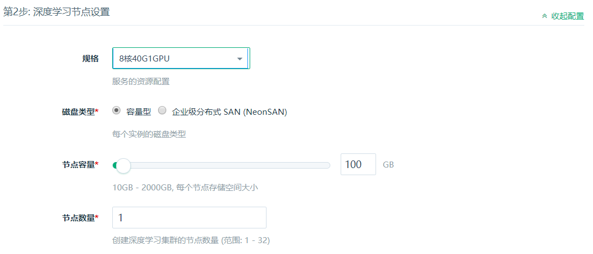
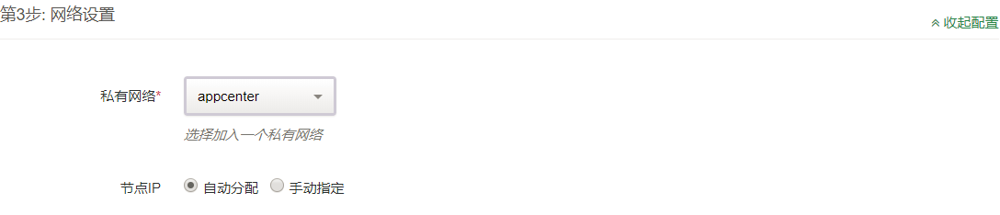

---
---

# Deep Learning on QingCloud AppCenter 用户指南


## 深度学习简介

2016 年 AlphaGo 战胜李世石，预示我们进入了 AI 时代。深度学习是 AI 的核心技术，在图像分类，自然语言处理，无人驾驶等众多领域显示出了强大的能力，各大巨头纷纷投入巨资研发。语音助手，人脸识别，外文翻译等等，AI 已融入到了我们生活的方方面面，极大了促进了社会的发展。其中 Caffe，TensorFlow，Keras，PyTorch 是主流的深度学习框架，拥有强大的社区支持，是实践深度学习不可或缺的工具。

### Caffe

Caffe 是一个被广泛使用的深度学习框架，由 BVLC 开发。Caffe 容易上手，训练速度快，组件模块化，并拥有大量训练好的经典模型。Caffe 在 GPU 上训练的性能很好，但只能支持单机多 GPU 的训练，不支持分布式多机训练。

### TensorFlow

TensorFlow 由 Google 大脑主导开发，是一个分布式系统上的大规模深度学习框架。移植性好，可以运行在移动设备上，并支持分布式多机多卡训练，支持多种深度学习模型。TensorFlow 还有功能强大的可视化组件 TensorBoard，能可视化网络结构和训练过程，对于观察复杂的网络结构和监控长时间、大规模的训练很有帮助。

### PyTorch

PyTorch 从 Torch 发展而来，并经过了大量改进，由 FaceBook AI 团队主导开发。不同于 TensorFlow，PyTorch 采用动态计算图的方式，并提供良好的 Python 接口，代码简单灵活，使用起来非常方便。内存分配也经过了优化，能支持分布式多机训练。

### Keras

Keras 是一个高层神经网络 API，由 Python 编写，通过调用其他深度学习框架来进行计算，如 TensorFlow、Theano 以及 CNTK。Keras 高度模块化，能快速搭建神经网络，并且非常容易上手。

## 青云深度学习平台

基于青云提供的 NVIDIA Tesla P100 GPU，青云深度学习平台提供了 CUDA9.1+cuDNN7.1.3 ， CUDA8.0+cuDNN7.1.3 和 CPU 等3套配置，并安装了流行的深度学习框架，如 Caffe(BVLC)，TensorFlow(1.6.0/1.7.0)，Keras(2.1.5)，PyTorch(0.3.1)，省去了用户搭建环境的麻烦，提高开发效率。用户无需修改代码，即可把本地的代码运行在云上，还能动态扩展所需资源。
青云深度学习平台组件版本对照表

App版本 | TensorFlow | Caffe | PyTorch | Keras
-------- | ----- | ----- | ----- | -----
CUDA 9.1 | 1.7.0 | BVLC  | 0.4.0 | 2.1.5
CUDA 8.0 | 1.6.0 | BVLC  | 0.3.1 | 2.1.5
CPU      | 1.7.0 | Intel | 0.3.1 | 2.1.5

> <font color=red>目前仅 pek3a , pek3b , sh1a 支持 GPU，如需在其他区创建请选择CPU版并将 GPU 数量设置为 0。TensorFlow，PyTorch ， Keras 和 Caffe 均支持用 CPU 进行深度学习应用的训练和测试。</font>

本说明文档仅对应青云深度学习平台1.1版本，1.0版本说明文档请参考[青云深度学习平台1.0](./1.0)。

## 部署 Deep Learning 服务

### 第1步：基本设置


- 填写服务名称和描述，选择版本。

### 第2步：计算节点设置



- 填写节点 CPU、GPU、内存、节点类型、节点个数、数据盘大小等配置信息。

### 第3步：网络设置



- 出于安全考虑，所有的集群都需要部署在私有网络中，选择自己创建的已连接路由器的私有网络中。

### 第4步：环境设置


- Deep Learning app 与 QingStor 命令行工具集成，[配置 QingStor](https://docs.qingcloud.com/qingstor/command_line_tools/qsctl.html) 相关参数，可以方便的从 QingStor 拉取数据。如果 QingStor 选用 false，access_key 和 secret_key 则无需填写。

## Deep Learning 测试

### 测试环境

深度学习平台使用 VirtualEnv 来管理 Python 环境，Python 的版本为 2.7 和 3.6 ，并装有 numpy，scipy，pandas，matplotlib，nltk，scikit-learn，jupyter notebook 等常用工具包。下面将以 MNIST 数据集为例，分别测试 Caffe，TensorFlow，PyTorch 和 Keras。

平台已经为用户安装好了Python 2.7和Python 3.6的VirtualEnv环境，并在其中预装了深度学习框架和常用工具包，放在ubuntu用户根目录的workspaces文件夹，py2和py3分别对应Python 2.7和3.6版本。用户登录后，使用如下命令激活和退出
```shell
source /home/ubuntu/workspaces/py2/bin/activate
deactivate
source /home/ubuntu/workspaces/py3/bin/activate
deactivate
```
VirtualEnv的激活和退出

> <font color=red>建议在任何框架上运行程序前都用如上方法选择 python 运行环境，安装和更新 python 库也在VirtualEnv中进行，保持系统自身 python 环境的清洁，并实现在同一个系统中不同版本的 python 和框架共存。
> 用户可以将自己常用环境的激活命令增加到.bashrc中，这样登录后即可自动激活对应版本python的运行环境。
> 在一个环境激活后，直接输入python命令即可运行对应版本的python，不需要显式指定python2或python3，输入命令前注意命令提示行开头小括号中的信息，py2和py3分别对应2.7和3.6版本的python。</font>

深度学习平台为用户准备了环境完整性测试样例，放在ubuntu用户根目录的test文件夹，使用MNIST数据集对Caffe，TensorFlow，PyTorch和Keras进行测试。
> [MNIST](http://yann.lecun.com/exdb/mnist/) 是著名的手写数字数据集，包含 0~9 十个各种风格的手写数字，经常用于深度学习入门及测试。其内容分为训练集和测试集，训练数据集包含 60,000 个样本，测试数据集包含 10,000 样本，数据集中的每张图片由 28x28 个像素点构成。

Deep Learning 训练往往需要大量的数据，数据存储经常占用很大的空间。青云 QingStor 可以存储海量数据，用户可以方便的把数据放在 QingStor，再使用 QingStor 命令行工具快速的下载到本地。如果在环境设置中配置好了 QingStor (如果没有也可在本地[配置](https://docs.qingcloud.com/qingstor/command_line_tools/qsctl.html))，从 QingStor 获取数据：

```shell
cd /home/ubuntu/tensorflow
mkdir data
qsctl cp -r qs://mydata/ data/
```

> 节点登录信息：ubuntu/p12cHANgepwD

### Caffe 测试示例

Caffe 支持 Python 接口，深度学习平台已经提供，目前不支持多机分布式训练，详情请见 [Caffe 文档](http://caffe.berkeleyvision.org)。(**GPU和CPU版本App分别内置了不同版本的 Caffe ，请依据硬件情况选择需要部署的版本。**)

#### 单机

caffe单机示例：

```shell
cd /home/ubuntu/caffe-py2
./build/tools/caffe train --solver=examples/mnist/lenet_solver.prototxt
```

Caffe 训练过程


Caffe 训练结果


PyCaffe单机示例：

```shell
activate /home/ubuntu/workspaces/py2/bin/activate
cd /home/ubuntu/test/pycaffe
python mnist.py
```
PyCaffe 训练过程


PyCaffe 训练结果


查看 GPU 使用情况，可以使用如下命令：

```shell
nvidia-smi
```

GPU 使用情况


### TensorFlow 测试示例

完整信息请见 [TensorFlow 文档](http://tensorflow.org)

#### 单机：

```shell
cd /home/ubuntu/test/tensorflow
python mnist.py
```
TensorFlow 训练过程

TensorFlow 训练结果


#### 分布式：

增加节点，在线扩容：在详情页点击 `新增节点` 按钮，可以对每个新增节点指定 IP 或选择自动分配。  
TensorFlow 增加节点


TensorFlow 分布式训练需要指定 parameter server 和 worker 的 IP 地址和端口号（根据自己的 IP 进行修改）  
下面是一个 parameter server 和两个 worker 进行分布式训练的示例：  

节点 1：

- 启动 parameter server

```shell
cd /home/ubuntu/test/tensorflow
python mnist_dist.py --ps_hosts=192.168.1.6:2221 --worker_hosts=192.168.1.6:2223,192.168.1.7:2223 --job_name=ps --task_index=0
```

- 启动第一个 worker

```shell
cd /home/ubuntu/test/tensorflow
python mnist_dist.py --ps_hosts=192.168.1.6:2221 --worker_hosts=192.168.1.6:2223,192.168.1.7:2223 --job_name=worker --task_index=0
```

节点 2：

- 启动第二个 worker （**注意：是在第二个节点即新增节点上启动**）

```shell
cd /home/ubuntu/test/tensorflow
python mnist_dist.py --ps_hosts=192.168.1.6:2221 --worker_hosts=192.168.1.6:2223,192.168.1.7:2223 --job_name=worker --task_index=1
```
TensorFlow 分布式训练过程

TensorFlow 分布式训练结果


#### 开启 TensorBoard 服务

TensorFlow 中的 TensorBoard 提供了训练过程中丰富的信息，默认端口号为 `6006`。在某一节点上启动一下命令：

```shell
tensorboard --logdir=./tflog/
```

TensorBoard 展示结果


> 您可以通过如下方式之一查看 TensorBoard UI：
> 1. 如需在TensorBoard中显示相关信息，需要编写相关代码。TensorBoard详细用法请参考 [Github TensorBoard](https://github.com/tensorflow/tensorboard) 页面。
> 2. 通过公网访问，您需要先申请一个公网 IP 绑定在路由器上，在路由器上设置端口转发，同时打开防火墙相应的下行端口。
> 3. 或参考[VPN 隧道指南](https://docs.qingcloud.com/guide/vpn.html) 配置 VPN，通过私网 IP 地址访问。  

### PyTorch 测试示例

完整信息请见 [PyTorch文档](http://pytorch.org/)

#### 单机

```shell
cd /home/ubuntu/test/pytorch
python mnist.py
```

PyTorch 训练过程

PyTorch 训练结果


#### 分布式

> PyTorch 分布式训练时，由于当前版本的 PyTorch 尚未支持CPU分布式训练，请选择GPU版本进行分布式训练。

节点 1：

```shell
cd /home/ubuntu/test/pytorch
python mnist_dist.py
```

节点 2：

```shell
cd /home/ubuntu/test/pytorch
python mnist_dist.py
```

PyTorch 分布式训练过程

PyTorch 分布式训练结果


### Keras 测试示例

Keras 默认使用 TensorFlow 来计算，目前青云平台上也只支持 TensorFlow 作为其计算框架。详情请见 [Keras 文档](https://keras.io)

#### 单机

```shell
cd /home/ubuntu/keras
python mnist.py
```

Keras 训练过程

Keras 训练结果


为了方便开发，环境中配有 jupyter notebook，用户可以交互式编程，并能直观展现实时计算结果。
jupyter notebook 启动命令

```shell
cd /home/ubuntu/test/keras
jupyter notebook
```

新版本的jupyter notebook，需要在启动时配置IP地址参数，才能接收远程浏览器客户端的访问。启动命令如下，读取eth0的IP地址并设置到jupyter notebook

```shell
cd /home/ubuntu/test/keras
jupyter notebook --ip=`ifconfig eth0 2>/dev/null|awk '/inet addr:/ {print $2}'|sed 's/addr://'`
```

jupyter notebook 默认端口号为 `8888`，启动上述命令后会输出 token 信息，这个信息在下面访问 notebook 时候需要。
> 如果需要通过公网访问这些信息您需要先申请一个公网 IP 绑定在路由器上，在路由器上设置端口转发，同时打开防火墙相应的下行端口。为了方便使用 jupyter notebook，也可参考[VPN 隧道指南](https://docs.qingcloud.com/guide/vpn.html) 配置 VPN。

jupyter notebook 开发环境浏览项目代码

jupyter notebook 开发环境运行项目


## 版本历史

### v1.0

- 初始版本

### v1.1

- 区分CUDA 8.0， CUDA 9.1 和 CPU 版本
- 更新深度学习框架版本